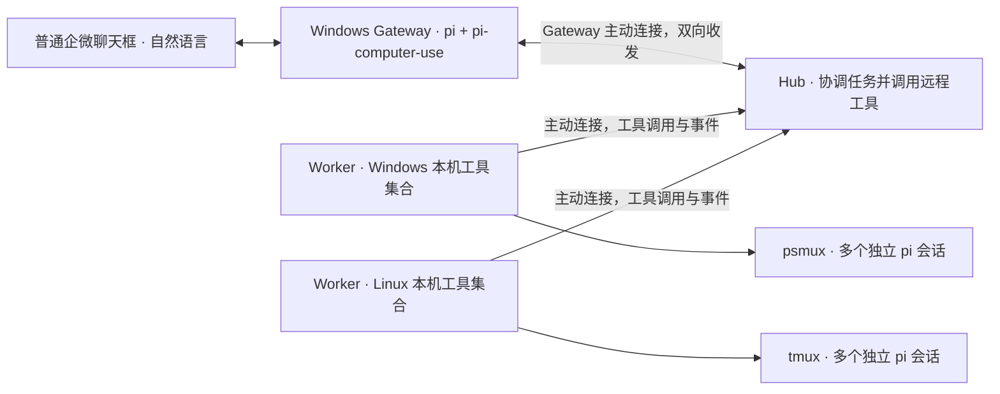

# RelayDock · 驿站

在普通聊天框里用自然语言交代任务、查看多台机器上的 Agent 状态、获取结果，并继续执行。

初始环境是互通的内网、Windows 和 Linux 混合部署；其中一台 Windows 已登录企业微信，用户无法执行管理员操作。入口是普通企微聊天会话，用户不需要命令前缀、固定语法或任务 ID。聊天渠道和 Agent 实现都需要可替换。

**当前阶段：首个可运行原型。** 已实现 Go Hub / Worker、自然语言 console、tmux 中的交互式 pi 桥接、SQLite 回执与事件恢复，以及供现有企微操作 pi 使用的 Gateway 工具。目标 Windows 的 psmux 与企微端到端接线仍待验证。

**已确认的基础能力：**用户已在目标 Windows 上安装 [pi-computer-use](https://github.com/injaneity/pi-computer-use)，打开普通 pi 会话后直接用自然语言要求“看消息 / 发消息”，已验证普通企微聊天的读取与发送均技术可行。Gateway 沿用这个入口，在同一个 pi 中额外加载 RelayDock 消息桥接扩展。

## 架构方向



- **Hub**：理解用户意图、协调任务、选择节点与会话、调用 Worker 工具、维护任务状态和结果，安排并发并同步 Session 消息。
- **Worker**：每台机器一个，向 Hub 提供本机远程控制工具，执行明确调用并返回结果和事件；不自行理解用户任务、分配工作或决定重试策略。
- **Channel Adapter**：首个实现复用 pi + pi-computer-use，把读取的企微消息转换成统一输入，把结果发送回原会话。
- **Agent Adapter**：首版接入交互式 pi，使用小型 pi 扩展传递任务和结构化事件；tmux/psmux 保持终端并提供人工接入。后续可替换执行 Agent。

**核心运行角色是 Hub 和 Worker，聊天与 Agent 是可替换的适配部分。** 当前普通企微聊天入口仍需要独立 Windows Channel Gateway；它封装已验证的 pi + pi-computer-use 收发链路。这里操作企微的 pi 与执行任务的 pi 使用独立会话和配置。适配代码与 Worker 同进程，桥接扩展跟随各自 pi 运行；Hub 内的对话模块不另起服务。

Worker 首版提供主机/会话查询、创建会话、向 Agent 提交或回复消息、查看输出和中止运行等工具。Hub 按任务需要组合调用；Worker 保留参数校验、目标定位、调用去重和本机执行冲突检查。工具列表按实际需求扩展，首版用静态注册和既有 WSS 连接，不另建插件平台。

RelayDock 核心的默认实现建议：**Go、单仓库、单可执行程序、Hub 使用 SQLite、Worker 主动建立 WSS 连接**。Windows Gateway 另外复用已安装的 pi 及 pi-computer-use。跨机器协议不绑定实现语言。

首版执行方式采用 **Linux tmux / Windows psmux + 交互式 pi**。一个 RelayDock Session 对应一个独立的终端会话和 pi 会话，多个 Session 可以在同一主机并行。用户可以直接 attach 查看和输入，也可以通过企微继续同一个 Session，无需切换控制权。终端保持不等于 pi 永不崩溃，运行结束与故障仍以 pi 事件和状态核对为依据。详见 [tmux + pi 运行方案](docs/runtime-tmux-pi.md)。

**用户负责理解和衔接两端的信息。** 本地看过或操作过 Session，相关消息仍照常同步到企微；不维护跨端已读状态，也不因人工在线暂停同步或远程输入。工具调用去重用于防止重复执行，与用户是否已经看过消息无关。

## 首版范围

1. 用“让那台 Linux 检查一下后端测试”等自然语言创建任务，按已知别名和聊天上下文定位目标，缺信息时追问。
2. 接收开始、等待输入、完成和失败等通知，查询结果。
3. 使用同一 Agent 的原生会话继续任务；取消和运行中输入按适配器能力提供。
4. 断线重连后核对状态，避免重复派发导致重复执行。
5. 同机多 Agent 并行，用户可直接在终端参与任意受管会话，消息继续同步企微；会修改同一目录的任务先串行或使用不同 worktree。

例如，用户说“现在怎么样了？”可查询当前任务；收到结果后说“按第二个方案继续”可沿用原会话。多个任务都可能符合指代时先澄清，不要求用户改用命令。任务 ID 留在内部，回复使用机器和任务的易读名称。

首版管理由 RelayDock 启动的任务。对外部已运行 Agent 的导入，需要目标工具提供可验证的会话或进程接入能力，暂不作为通用承诺。

## 启动原型

需要 Go 1.25+、tmux 和已配置模型的 pi。桥接已在 pi 0.85.1 上验证。

```sh
go build -o build/relaydock ./cmd/relaydock
./build/relaydock init --dir .relaydock --workspace /path/to/project \
  --model-url http://your-model-host:8000/v1 --model your-model
```

按需在生成的 `hub.json` 中配置 `model.key: "env:RELAYDOCK_MODEL_KEY"`，然后在三个终端分别运行：

```sh
./build/relaydock hub --config .relaydock/hub.json
./build/relaydock worker --config .relaydock/worker.json
./build/relaydock chat --config .relaydock/channel.json
```

输入“有哪些机器”“在本机的 project 项目检查一下测试”“现在怎么样”“继续检查失败原因”等自然语言。Hub 模型需要支持 OpenAI Chat Completions 的 JSON object 输出；任务 pi 使用自己的模型配置，两者相互独立。

详细配置、Windows 部署、企微接线和恢复限制见 [运行与接线指南](docs/getting-started.md)。现阶段同一目录只允许一个活跃 Session；不同目录或 worktree 可以并行。所有运行中会话都可直接 attach，不设置人工接管状态。

## 验证

```sh
go test -race ./...
RELAYDOCK_TEST_PI=1 go test ./internal/hub -run TestRealPiRuntime -v -count=1
```

第二条启动真实 tmux、交互式 pi 和独立 Worker 进程，模型使用隔离的本地测试服务，不调用外部模型或发送企微消息。覆盖同机两会话、原会话续接、本地输入回传、Worker 重启、重复输入、中断和 pi 退出。

Windows/Linux 可执行文件可用 `CGO_ENABLED=0` 交叉编译；编译成功不代表目标 Windows 上的终端与桌面收发已经验证。

详细的部署拓扑、模块边界、运行语义与实施顺序见 [架构设计](docs/architecture.md)。
