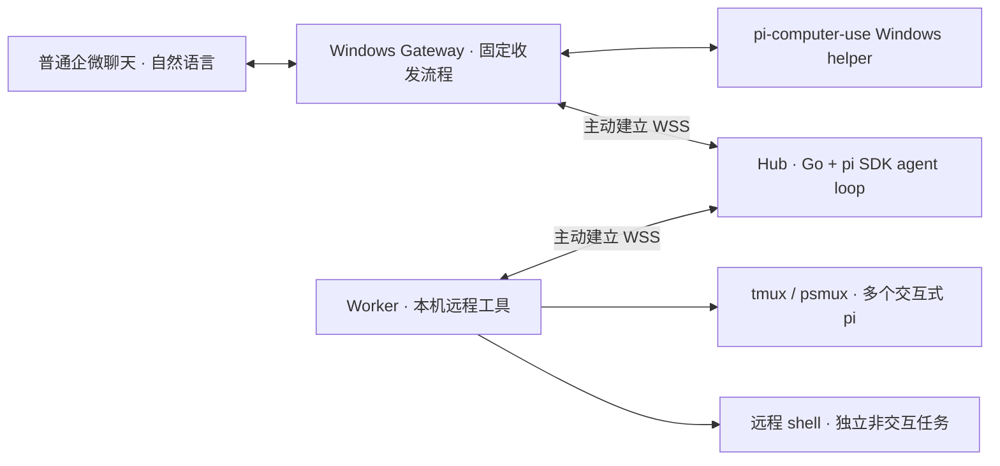

# RelayDock · 驿站

在普通聊天框里用自然语言交代任务、查看多台机器上的 Agent 状态、获取结果，并继续执行。面向内网 Windows / Linux，受限 Windows 只主动连接 Hub，不需要管理员权限或入站端口。

当前原型采用 **固定程序操作企微，pi SDK 协调任务，Worker 提供远程工具**。执行 Agent 仍是 tmux / psmux 中的交互式 pi，允许同时运行多个独立会话，用户可以随时在本地终端参与。



- **Gateway**：定时读取指定聊天、提取新消息、保存检查点、按顺序发送 Hub 回复并核对回显。直接调用 pi-computer-use 的原生 Windows helper，无需另开企微操作 pi，也不调用模型。
- **Hub**：通过成熟的 pi SDK 完成多步工具调用、对话延续和上下文压缩。Go 检查权限与参数，保存回执和事件，支持在指定 Run 结束后唤醒 Hub 处理已授权的后续安排。
- **Worker**：提供 pi 会话与 remote shell 工具，报告状态和结果。shell 支持并发、增量日志、超时/取消与断线补报；执行任务的 pi 保留自己的模型、会话、扩展和交互终端。

用户已经在目标 Windows 验证了 pi + pi-computer-use 收发普通企微消息的可行性。**新 Gateway 的 UIA 消息提取、发送控件和 psmux 仍需在目标 Windows 验证。** 仓库提供配置模板和只读检查命令，不把示例控件当成真实企微控件。

## 本地启动

构建需要 Go 1.25+；Hub 需要 Node.js 和已安装 pi SDK 的 pi，交互式 Worker 需要 pi 与 tmux / psmux。只运行 shell 的 Worker 不需要 pi 或 mux。当前 SDK 与交互式桥接在 pi 0.85.1 上验证；模型需要支持 OpenAI Chat Completions 的流式工具调用。

```sh
go build -o build/relaydock ./cmd/relaydock
./build/relaydock init --dir .relaydock --workspace /path/to/project \
  --model-url http://your-model-host:8000/v1 --model your-model
```

按需配置 `hub.json` 的 `model.key: "env:RELAYDOCK_MODEL_KEY"`。分别启动：

```sh
./build/relaydock hub --config .relaydock/hub.json
./build/relaydock worker --config .relaydock/worker.json
./build/relaydock chat --config .relaydock/channel.json
```

可以说“有哪些机器”“在本机的 project 项目检查测试”“现在怎么样”“按刚才的建议继续”。Hub 根据自然语言和会话上下文调用工具；创建会话与提交输入是不同步骤，提交成功不代表任务完成。

新生成的 Worker 默认启用 remote shell。仅需要 shell 时，`init` 加 `--shell-only`；旧 Worker 配置通过 `"shell": {"enabled": true}` 单独开启。用户可以说“在本机 project 目录运行测试”“查询刚才命令的输出”“取消刚才的命令”。每次调用独立，长命令完成后自动通知；详细语义与配置见 [remote shell 指南](docs/remote-shell.md)。

Hub 每个协调回合启动一个 Node 子进程，按 Channel 恢复 pi 原生历史；SDK 代码随 Go 二进制内嵌，包使用本机 pi 安装。如果自动定位失败，在 Hub 配置中指定 `coordinator.package` 为已安装的 `@earendil-works/pi-coding-agent` 包目录；`coordinator.node` 可指定 Node 可执行文件。

## Windows 企微接线

使用 [配置模板](examples/wecom-channel.json)，先在目标 Windows 上通过只读命令检查窗口和消息行：

```powershell
.\relaydock.exe wecom-inspect --config channel.json
.\relaydock.exe wecom-inspect --config channel.json --pid 1234 --root-ref "观察到的窗口引用"
```

校准控件和消息提取规则后，打开指定聊天，运行 `relaydock.exe channel --config channel.json`。第一次成功观察只建立历史基线；日志出现 `baseline established` 后再发送新请求。默认每两秒轮询。完整步骤、未知发送处理和限制见 [运行与接线指南](docs/getting-started.md)。

Gateway 复用 [pi-computer-use](https://github.com/injaneity/pi-computer-use) 的 helper protocol v3。新实现不再使用 `extensions/wecom-gateway.ts`；原有文件 spool 保留为通用渠道接口。

## 状态与拓展边界

用户直接 attach、阅读和输入，消息仍同步企微；不维护人工接管或跨端已读状态。同一个真实目录及其上下级目录只分配一个活跃 Session，不同目录 / worktree 可并行。tmux 保持终端并不保证 pi 不崩溃，状态以心跳、Agent 事件和退出记录为依据。

核心保留 Go、SQLite、单个可执行程序和现有 WSS 协议。更换推理实现走 `hub.Coordinator`；更换聊天实现走 `internal/channel`；更换桌面提取方式走 `wecom.Desktop`；执行 Agent 的适配保持在 Worker 与 pi 扩展。没有额外消息队列服务或插件平台。

## 验证

```sh
go test -race ./...
go vet ./...
RELAYDOCK_TEST_PI=1 go test -race ./internal/hub -run 'TestRealPi(RemoteRuntime|Runtime)$' -v -count=1
```

真实集成测试运行 pi SDK、多步工具调用、完成后唤醒、tmux 和交互式 pi，模型用隔离的本地测试服务。覆盖多会话、续接、本地输入回传、Worker 重启、去重、中断和 pi 退出。Gateway 使用本地协议与桌面夹具测试；测试不发送真实企微消息。

[Remote shell](docs/remote-shell.md) · [架构设计](docs/architecture.md) · [运行指南](docs/getting-started.md) · [tmux / psmux 运行方案](docs/runtime-tmux-pi.md)
