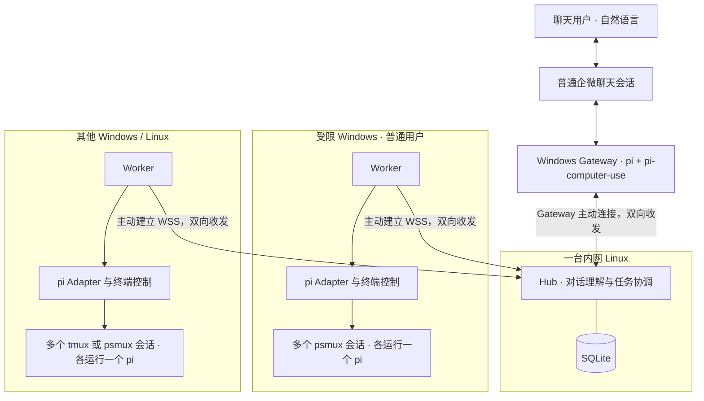
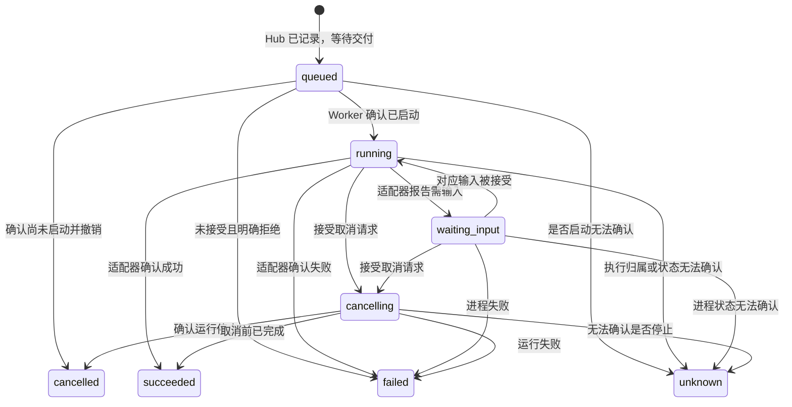

# RelayDock 架构设计

状态：v0.6 架构基线，2026-09-10。已有首个 Go 原型；当前实现范围、部署说明与尚未接通的目标环境见 [运行指南](getting-started.md)。Hub 协调任务并调用工具，Worker 提供本机远程控制工具。用户可在普通聊天和 tmux/psmux 中参与同一个 pi Session，自行衔接两端信息；消息持续同步，不增加人工接管、交还或跨端已读状态。用户已用 pi + pi-computer-use 验证企微收发；运行约定见 [tmux + pi 运行方案](runtime-tmux-pi.md)。本文后续条目保留设计目标，不将其全部等同于已验收功能。

## 1. 目标与约束

在普通聊天中用自然语言操作多台内网机器上的 Agent：交代任务，追问进展、结果，并继续同一个任务上下文。用户不需要输入命令、固定前缀、机器 ID 或任务 ID。首版以一个使用者、少量机器为规模基线，同时支持 Windows 和 Linux。

已知条件：机器网络互通；一台 Windows 安装并登录了企业微信；Windows 有防火墙，用户不能执行管理员操作。企微入口是普通聊天会话，不能默认替换成企业应用或机器人专用会话。企微可以替换，Agent 可以替换，本文将 `cc` 暂按 Claude Code 理解。

已验证能力：用户在上述 Windows 上通过 **pi + pi-computer-use** 完成了聊天收发验证。普通聊天收发的基础可行性已成立，后续工作直接围绕现有链路的封装与系统集成展开。

以下条件尚未确认，不能从“网络互通”或“装有企微”推导出来：

| 待确认条件 | 对设计的影响 |
| --- | --- |
| 有一台 Linux 能提供各机器可访问的 TCP 端口 | 作为 Hub；实际端口需要连接测试，不假定 443 自动放行 |
| Windows 允许普通用户启动 RelayDock 和目标 Agent | 无管理员安装不等于允许执行所有用户程序 |
| 现有 pi + pi-computer-use 链路如何接入 Gateway | 沿用已验证的安装和调用方式，封装消息上报、发送结果与持续运行 |
| Hub 能否调用可用的语言模型 | 决定自然语言理解能否落地；不默认内网 Linux 能访问外部模型服务 |
| 目标 pi 与 psmux 的版本及支持能力 | 首版 pi 交互界面保留在 tmux/psmux 中，扩展 API 与终端控制按安装版本校准 |

首版不提供远程桌面、通用 SSH 替代、跨机器文件同步、按负载自动选机或多租户平台。执行目标来自用户自然语言、已建立的会话上下文或预先配置的唯一默认值；仍有多个可能目标时追问，不猜选。Windows 上所有动作使用当前普通用户权限，不要求安装系统服务或修改防火墙。

## 2. 部署拓扑：由受限机器主动连接

默认将 Hub 放在一台内网 Linux 上。Hub 是唯一需要向内网提供监听端口的 RelayDock 角色；Worker 主动连接 Hub，命令和结果通过同一条双向连接传递。



图中的 Worker → Hub 箭头表示建立连接的方向，不代表消息只能单向传输。Windows 不需要向内网开放 RelayDock 入站端口；Linux 也不通过 SSH、WinRM 或 SMB 进入 Windows 执行任务。psmux 自身使用本机 loopback TCP 做客户端与后台进程通信，这是本机通信，仍需在目标策略下可用。

默认使用 WSS。若内网使用私有 CA，在 RelayDock 自身配置中指定信任根，不要求写入 Windows 系统证书库，不关闭证书校验。连接使用企业允许的地址、端口和代理设置；若目标环境禁止 WebSocket，再依据实际限制引入 HTTPS 长轮询，首版不同时实现两套传输。

Worker 以当前用户的普通进程启动。pi 由独立的 tmux/psmux 会话承载，Worker 退出后应能继续运行；重连时重新定位会话。关闭或 detach 一个终端客户端不应结束 pi，但这不保证 pi 自身不崩溃，也不保证注销、系统重启或复用器后台进程退出后继续存活。自启动是后续部署选项，不作为首版能运行的前提。

若没有任何可承载 Hub 的内网监听端点，需要重新确定中心节点位置；本提案不默认增加公网服务器或穿透服务。

## 3. 两个核心角色与可替换的适配器

Hub 是任务协调者；Worker 是部署在远端机器上的工具集合。Hub 决定下一步调用哪个工具、针对哪个目标以及如何处理结果，Worker 执行已明确的操作并报告本机事实。实际执行用户工作的智能体是 tmux/psmux 中的 pi，不是 Worker 自己再运行一轮模型推理。

| 模块 | 职责 | 明确边界 | 默认运行位置 |
| --- | --- | --- | --- |
| Channel Adapter | 通过 pi + pi-computer-use 收发企微消息，映射发送者和会话、处理格式与发送节奏 | 不决定任务路由或状态，不管理 Worker 中的执行任务 | 当前为 Windows Gateway |
| Hub | 理解对话、选择节点和会话、组合远程工具、安排并发、维护任务状态并同步消息 | 不依赖特定终端命令，不代替执行 Agent 完成具体代码任务 | 内网 Linux |
| Worker | 公布本机工具，校验并执行调用，定位会话、落实本机互斥、返回操作结果与事件 | 不理解业务意图，不自行选任务、排序、跨机调度或自动重试 | 每台执行机器一个 |
| Agent Adapter | 首版通过小型 pi 扩展交换任务与运行事件，管理原生会话引用 | 不依赖企微 API，不把终端文本当权威任务状态 | Worker 侧适配代码 + pi 内扩展 |

当前入口按普通 Windows 企微聊天接入设计，Channel Adapter 放到独立 **Channel Gateway** 进程里。Gateway 主动连接 Hub，不在 Windows 上开端口。这是同一渠道模块的独立部署方式，不新增一套任务调度逻辑。未来更换到可以直接接入的聊天渠道时，可将 Channel Adapter 合并进 Hub。

pi 在这里有两个独立角色：Gateway 里的 pi 使用 pi-computer-use 操作聊天客户端；Worker 里的 pi 或 Claude Code 执行用户任务。二者使用独立会话、提示和工具配置，可以复用同一份 pi 安装，但不共用一个任务上下文。更换聊天实现不要求更换执行 Agent。

自然语言理解与任务协调由 Hub 内的对话模块负责：结合上下文和可用工具形成下一步调用，经普通代码校验后派发。它可以按返回结果继续查询、调用另一个工具或向用户澄清，不需要预先生成整张工作流，也不新增一个协调服务。执行机器上的 pi 继续负责具体任务推理、工具调用和代码操作。

首版通过静态代码注册适配器，例如 `channel=wecom-pi`、`channel=console`、`agent=pi`。新增渠道或 Agent 时修改注册表并重新构建即可。不建设动态插件市场、插件生命周期框架或统一 RPC 插件宿主。若某个适配器必须使用 C# 等工具，再局部增加子进程 helper。

Worker 的工具处理函数调用本机终端与 Agent 适配器：Linux 用 tmux，Windows 用 psmux，pi 扩展传递消息和事件。一次 `session.create` 可以在内部完成创建终端、启动 pi、等待就绪这些确定步骤，不要求 Hub 逐条拼接平台命令。本地交互和同机并发的具体规则见运行方案。

决策与执行检查按下面的边界区分：

| 事项 | Hub 决策与记录 | Worker / pi 扩展本机执行 |
| --- | --- | --- |
| 并发 | 决定哪些任务可以同时开始、目标节点与工作目录 | 检查实际容量、会话空闲和目录冲突；冲突时拒绝，不自己重新排队 |
| 本地交互 | 将同一 Session 的消息和结果照常同步企微，不推断用户是否看过 | 用户直接 attach 和输入；记录实际输入、轮次和会话变化，不切换控制权 |
| 运行状态 | 将操作结果和 Agent 事件归入 Session/Run，形成任务状态 | 报告是否接受输入、pi 状态、结果、错误和本机观察时间 |
| 故障处理 | 决定查询、澄清、恢复或明确重试；保存业务状态 | 返回错误、定位原实例、去重和补报；不另起一个 Agent 代跑 |

Worker 仍需保存少量会话定位、调用回执、pi 实例标识与未确认事件；工具集合不等于完全无状态。完整用户对话、任务依赖和下一步决策仅由 Hub 管理。

## 4. 首个聊天适配器：pi + pi-computer-use

基础收发已由用户在目标 Windows 上验证。首版 Gateway 复用这条链路，将其包装为统一的收发接口，不再把“能否读写普通企微聊天”作为待解决前提。具体 pi 启动方式、扩展版本及可调用接口在实现时依据用户现有配置接入，本文不臆造 pi-computer-use 的 API。

Gateway 的最小职责是：

1. 让 pi 读取绑定会话中的新消息，保留用户原文和可识别的来源信息，形成 `ChatInput` 发给 Hub。
2. 接收 Hub 的 `ChatOutput`，让 pi 在指定的原会话发送给定文本，不在发送阶段重新解释任务或改写业务结果。
3. 在本地保存读取位置、已上报消息和发送记录，避免历史消息、同一消息的重复观察及 RelayDock 自己的回复进入新请求流程。
4. 将消息投递与 UI 操作是否成功明确反馈给 Hub，供重试或核对使用。

首版用一个串行的桌面操作循环协调读取和发送，避免多个 pi 会话同时争用同一个聊天窗口。新消息检查的频率可以配置；当前验证没有说明企微是否提供事件通知，因此先不假定能订阅原生消息事件。操作任务由 Gateway 调度，Hub 与 Gateway 之间的心跳、网络重连不等待一次桌面操作完成。

如果现有链路能返回稳定消息标识，直接使用；否则 Gateway 根据持久化读取位置与上下文锚点识别同一条消息，再分配稳定的本地事件 ID。不能在每次读取同一消息时分配新 ID，也不能仅按文本哈希去重，因为用户可能合法地连续说两次“继续”。无法区分新旧时先核对，不自动重投可能已执行的请求。

发送反馈区分“在目标会话中确认出现”“明确失败”和“结果未知”。发起点击不等于发送成功；超时后先核对原会话，不盲目重复发送。可见的已发送消息也不代表对方已经阅读。

首版先绑定一个指定会话与获准用户。已验证的收发能力作为基础；连续读取、来源绑定、去重、窗口状态变化和进程重启恢复属于接下来的集成验收范围，不推断这些都已由基础验证覆盖。

## 5. 最小领域模型与自然语言交互

只保留四个核心概念：

- **Node**：一台运行 Worker 的机器，包含稳定 ID、系统、可用 Agent、工作目录别名和最近心跳。
- **Session**：绑定 `node + workspace + agent` 的逻辑会话，记录所属聊天与授权用户，以及适配器提供的原生会话引用。
- **Run**：会话中一次任务提交或继续执行，拥有独立 ID、请求文本、状态和结果。
- **Event**：一次运行产生的进展、等待输入、结果或错误，携带 Run ID 与序号。

`Session` 管理上下文归属，`Run` 表示一次执行。同一 Session 可以有多个顺序执行的 Run，但一次只允许一个未结束的 Run。Hub 按任务目标和容量安排多个 Session 并行，Worker 执行调用时检查本机实际可用性。写入同一工作目录的会话由 Hub 安排串行，Worker 仍做最终冲突检查；并行改同一仓库时配置独立 worktree，不在首版建设自动 worktree 调度系统。

Run 完成表示本轮执行结束，不表示 Session 关闭。首版每个 Session 对应一个独立命名的 tmux/psmux 会话、一个 pi pane 和一个 pi 原生会话引用；pi 常驻接受后续轮次。记录终端实例身份、pane 标识和原生会话引用，不以当前激活窗口或屏幕上的序号定位任务。

Session 对用户是两个可用入口：本地 pi 终端和企微聊天。用户直接 attach 查看或输入，无需申请接管或执行交还。Hub 不因终端连接、本地输入或用户已经看过结果而暂停该 Session 的消息同步，也不维护跨端已读状态。用户自行理解两端已经发生的操作。

扩展持续记录本地和 Hub 输入及实际执行事件，来源仅用于关联，不表示谁拥有控制权。本地新轮次用稳定标识上报，Hub 据此建立本地来源 Run；对正在运行任务的本地补充输入关联到实际轮次，不再启动一份重复任务。断网时先保留事件，恢复后映射。

两端输入按 pi 实际接受的顺序处理。扩展提交时只检查目标实例、当前运行状态和交互是否有效；忙碌状态是否支持输入由 pi 适配器能力决定，不以“有人 attach”作为拒绝原因。若用户在本地切换了 pi 原生会话，更新定位并拒绝指向旧实例或旧交互的调用即可，不增加控制归属流程。

用户看到的是自然对话，例如：

| 用户说 | 系统行为 |
| --- | --- |
| “哪几台机器在线？” | 查询获准访问的节点，使用易读名称返回真实状态 |
| “让那台 Linux 检查一下后端测试为什么失败。” | 从机器与项目别名解析目标，建立 Session 和 Run，原始任务交给 Agent |
| “现在怎么样了？” | 查询当前对话聚焦任务的真实状态与最近事件 |
| “按第二个方案修改，再跑一遍测试。” | 将原话交给原 Agent 会话，发起下一轮执行 |
| “选第二个。” | 仅在当前明确等待该选项时，回复对应交互 |
| “先停一下 Windows 上那个任务。” | 定位任务并请求取消，确认停止后再回报 |
| “刚才结果是什么？” | 返回已保存结果；长结果明确说明摘要与截断 |

目标不够明确时，系统自然追问：“是开发机上的后端测试，还是测试机上的构建？”用户回答“后端那个”即可继续，不需要改写成命令。目标明确且已获准的操作直接处理，不为每条自然语言请求增加确认步骤。

`workspace` 仍是 Worker 本地配置的目录别名，但用户可以说“后端项目”等熟悉的名称。Hub 将这些名称映射到已知资源，不凭空生成文件路径，也不把自然语言拼成 shell 命令。内部 ID 用于关联和去重；日常回复显示机器名、任务描述与状态，ID 仅在诊断需要时呈现。

### 聊天上下文与 Agent 上下文分开

Hub 的聊天上下文按“渠道实例 + 会话/线程 + 发言用户”隔离，保存少量近期对话、当前聚焦 Session、待澄清问题及其候选目标。Agent 的完整任务上下文仍由其原生 Session 管理；一个普通聊天会话可以先后讨论多个 Agent Session，两者不是一对一关系。

指代优先使用用户明确提到的目标，或渠道可可靠提供的回复引用；其次使用当前用户已建立的会话焦点和唯一默认配置。只有一个合理候选时才执行；有多个合理候选、上下文已经过期或关键条件缺失时追问。自然语言模型给出的置信度不能代替资源查验。

会话焦点由用户明确指向任务、成功创建新任务或完成目标澄清来更新。其他节点异步发来的结果通知不能悄悄把“继续”的目标切走。待澄清内容绑定来源消息、候选目标和上下文版本；用户另起话题或目标状态改变后，不把旧回答错误地用于新操作。首版不增加向量库或通用长期记忆系统。

“继续”有两种不同含义，由真实运行状态决定：

1. 上一轮已经结束：内部 `continue` 创建新 Run，用原生会话引用恢复同一 Agent 上下文。
2. 当前 Run 正等待输入：内部 `respond` 对应当前未消费的交互 ID，将回答交给当前进程；不另外创建 Run。

如果任务仍在运行且未等待输入，“继续”只需回报它正在运行；新增修改要求是否能即时输入取决于适配器能力，不另起一个并行 Run。工具权限确认保留明确的交互类型、请求内容和选项；泛泛的“继续”不能自动批准无关的待确认操作。不支持运行中输入的适配器不暴露相应能力。

替换 Agent 指新建会话时可选另一适配器，不保证 pi 与 Claude Code 之间迁移原生上下文。首版也不迁移 Session 到其他节点或目录。对已在 RelayDock 外运行的 Agent，仅在适配器具备专门的接入能力后才支持导入；不能仅靠发现 PID 实现导入。

## 6. Worker 工具接口与两端适配

接口描述使用语言无关的语义，首版不发布独立 SDK。

### Hub 调用 Worker 的工具

Worker 建连时公布本机可用工具的名称、用途和参数/结果结构，以及终端和 Agent 能力。首版工具静态注册，复用现有 WSS 连接；不为了工具形式额外引入 MCP 服务、HTTP 监听或插件加载平台。以后需要对接其他工具客户端时再增加协议适配。

建议先实现以下工具；名字是内部接口草案，普通聊天用户不用输入它们：

| 工具 | 本机操作与返回内容 |
| --- | --- |
| `host.inspect` | 返回系统、可用工具、Agent、工作目录别名、容量与占用事实 |
| `session.list` / `session.inspect` | 列出或查询本机受管终端、pi 实例、当前活动及本地 attach 定位信息 |
| `session.create` | 按明确的 Agent 配置和工作目录创建终端会话、启动 pi、等待就绪，返回会话句柄 |
| `agent.submit` | 向指定 pi 会话提交 Hub 给出的任务原文和 Run ID，返回输入是否已接受 |
| `agent.respond` | 回复指定的等待交互，仅在适配器支持时提供 |
| `agent.interrupt` | 请求中止指定运行；真实停止由后续事件确认 |
| `terminal.capture` | 返回指定 pane 的有限终端文本，供查看与诊断 |
| `session.close` | 显式关闭指定受管会话，不操作其他 Session 或全局服务器 |

新增文件读写、进程操作或其他远控能力时，可以继续添加工具处理函数及其参数约定。首版按任务需要实现上述集合，Worker 的边界不限于“启动一个 Agent”，也不需要提前做完整远程管理平台。

一次调用至少包含 `version`、`call_id`、`tool` 和结构化 `arguments`；操作具体会话时携带目标实例和原生会话引用，回复等待输入时携带交互标识，启动业务轮次时携带 Hub 分配的 `run_id`。Worker 返回同一 `call_id` 的结果或明确错误，例如目标失效、资源忙碌、能力不支持。工具调用按 ID 去重；模型不直接传递平台命令字符串绕过处理函数。

**工具完成与任务完成分开。** `session.list` 可以直接返回查询结果；`agent.submit` 成功只说明 pi 接受了这条输入，不代表用户任务完成。pi 继续独立运行，Worker 主动推送带会话、Run/本地轮次标识及序号的事件。Hub 根据事件维护 Run，不用轮询终端文字猜进度。调用超时也不代表 pi 已停止，要用同一调用记录和会话查询核对，不能换一个 ID 盲目重复提交。

例如“让 Linux 上的 pi 检查后端测试”由 Hub 完成以下组合：查询节点与会话 → 选择已有会话或调用 `session.create` → 记录 Run 并调用 `agent.submit` → 接收真实事件并回复聊天。用户也可直接 attach 到该 pi 继续交流，新增结果仍回到企微，不需要任何接管工具。Worker 无需知道用户为何要检查测试或选择在哪个入口交流。

### 聊天与 Agent 适配

**Channel Adapter** 负责 `receive → ChatInput` 和 `send(ChatOutput)`：

- `ChatInput`：渠道实例、稳定的渠道事件 ID、发送者引用、会话/线程引用、原始文本，以及渠道确实能提供的回复引用和时间信息。事件 ID 可以来自平台，也可以由 Gateway 对同一观察事件持久化分配，Hub 不依赖平台内部 ID 的格式。
- `ChatOutput`：目的会话引用、RelayDock 通知 ID、文本及可选的回复引用。
- 平台消息长度、分段、限流与平台鉴权留在适配器；身份授权、消息去重和自然语言理解由 Hub 处理。适配器不要求命令前缀，也不丢弃未经命令格式化的用户消息。
- pi 读取到的会话和发送者由 Gateway 根据预配置的可信会话绑定映射成内部引用；可获得平台稳定 ID 时优先采用。不能让模型随意生成一个引用就获得新的身份授权。
- 无平台消息 ID 时按第 4 节维护读取位置与事件记录；不声称本地 ID 本身解决了视觉观察的重复识别。发送接口返回已确认、明确失败或未知，Hub 按结果推进待发通知。

**Hub 内的 IntentRouter** 提供 `interpret(message, context, resources) → decision`：

- 输入是当前用户原文、必要的近期对话、当前焦点，以及该用户可访问的机器/会话和真实状态。模型无须获取整个代码仓库或所有机器的完整日志。
- 输出受约束的意图或工具调用提案，携带目标引用、任务原文或澄清问题。首版仍围绕启动、继续、回复交互、中止、查询和澄清等已知操作；Hub 将其落实为一项或几项 Worker 工具调用，必要时根据结果继续决策。操作名和 ID 是内部协议，不是聊天语法。
- 对已选任务的具体执行要求和业务问题，保留用户原文与其澄清补充，交给对应 Agent；不要只保留路由模型改写后的摘要，丢掉用户约束。
- Hub 用普通代码检查字段、候选资源、身份、当前状态与工具能力，再通过工具分发代码调用目标 Worker。模型不能创建不存在的机器、跳过校验或直接执行 shell，也不能仅靠文字回复把 Run 标成成功。
- `clarify` 只发问题并保存待澄清上下文，不派发任务；`reply` 用于无需执行的对话回应。状态与完成通知根据已记录事件生成，业务结果以 Agent 输出为依据。

首版用一个可配置的模型端点和结构化输出或工具调用实现这个接口；端点可以是 Hub 可达的内网模型或获准服务，不默认可以出公网。Hub 模型与执行 Agent 的模型可以不同，也无需为每次任务开一个自主规划 Agent。替换模型只改该实现和配置，不改变 Worker 协议。

模型超时、输出非法或上下文过期时不派发操作，告知用户请求尚未执行；不能把原文回退成 shell 命令，也不要求用户改用固定指令。已有运行及其状态回传不依赖路由模型持续可用。对话记录和待处理决定持久化在 Hub 的 SQLite 中；首版不引入模型网关、复杂工具链或跨模型调度。

**Agent Adapter** 是 Worker 工具的内部实现，提供 `capabilities`、`run(request) → events`，并按能力提供 `respond` 和 `cancel`：

- `run` 接收 Run ID、已经解析的本地工作目录、任务文本与可选的原生会话引用；首次调用时创建原生会话，后续轮次使用原引用。
- 事件至少区分输出、等待输入、成功、失败和原生会话引用；完成结果依据目标工具真实事件与退出语义确定。
- 能力至少声明 `resume`、`interactive_input`、`cancel`。不支持时明确拒绝，不能悄悄新建会话来伪装“继续”。
- 首版保留 pi 的交互式 TUI，由一个小型 pi 扩展接收任务并上报结构化事件。Worker 与扩展使用本机通信；tmux/psmux 用于终端生命周期和人工 attach，`send-keys` / `capture-pane` 作为诊断或受控后备手段。其他 Agent 可以使用自身的 CLI 或本地协议，具体调用方式不写进 Hub。
- 原生会话引用作为不透明值保存；原始会话文件和工作目录保留在 Worker。本机数据丢失后，不承诺凭 Hub 里的引用恢复上下文。

MVP 的 pi 适配器必须验证“创建终端会话 → pi 就绪 → 提交任务 → 结构化结果 → 原会话续接”，并验证本地交互后的企微同步和 Worker 重启后的重新连接。根据安装版 pi 的实际事件判断运行：上游目前区分 `agent_end` 与 `agent_settled`，前者之后仍可能重试或继续，后者表示不再自动继续；两者都不能脱离结果与错误直接等同于业务成功。Agent 自身需要的运行时、登录信息和网络访问仍由该机器提供。

## 7. 通信与状态：能恢复，也承认不确定

Worker 与 Hub 使用一条带认证的 WSS 连接，JSON 消息包含 `version`、`type` 和消息 ID；工具请求与响应带 `call_id`，业务执行消息带 `run_id`，事件带单调递增的 `seq`。尚未映射到 Hub Run 的人工轮次用 pi 实例与本地轮次标识关联，Hub 登记后映射到 Run。Gateway 独立部署时复用同一连接机制，使用渠道角色，不能冒充 Worker。

首版只需要以下消息类别：

- 建连登记、工具与能力声明、心跳。
- `tool.call` / `tool.result`：Hub 调用工具，Worker 返回操作结果或错误。
- `event` / `event.ack`：Worker 上报本机事件，Hub 持久化后确认。
- 重连时报告既有会话、调用记录和未确认事件，由 Hub 核对任务状态。

版本不兼容时拒绝连接并给出原因。Hub 同时只接受一个 Node ID 的活动连接；重连替换旧连接后，旧连接不能再下发确认或更新状态。同一节点只允许一个本地 Worker 使用该状态目录。

一次运行的基本路径为：



`queued` 是记录到交付之间的短暂状态，不是产品级任务排队功能。Hub 在派发前检查节点在线与容量，Worker 再做最终检查；不要在机器离线时默认积攒未来会执行的命令。

网络断开时，Node 显示 `offline`，运行显示“最后已知状态 + 上报时间”。离线不等于失败或停止，原 Agent 可继续运行。Hub 不将失联任务自动迁移到其他节点，也不自动重启它。

Worker 重连时发现既有 tmux/psmux 会话，读取 pi 扩展的原生会话、当前运行与调用记录；Hub 据此核对并恢复任务状态。归属不明或启动确认丢失且无法解释时，Hub 将 Run 标为 `unknown`，停止对该 Session 和冲突目录派发；本机入口也拒绝无法核对目标的调用。其他独立 Session 可继续，只有无法界定影响范围时才冻结整个节点。记录人工处理结果；重试总是新的明确操作。

取消是请求，不是已经停止。首选 pi 自身的中止能力，并确认相关运行及工具操作已经停止后才显示 `cancelled`。结束 Run 不需要关闭整个终端 Session；正常路径不用 `kill-server`，强制结束只针对明确的目标 Session。Windows/Linux 子进程树的停止方式分别验证，不支持可靠取消时明确返回能力限制。

## 8. 最小持久化与重复消息处理

Hub 使用一个 SQLite 数据库，保存聊天上下文、任务与调用决定、Session/Run 状态、工具交付记录、渠道输入去重记录、必要事件以及待发通知。Worker 的本机 SQLite 只保存执行工具需要的调用回执、终端定位、原生会话引用、实例标识和未确认事件，不复制完整业务任务模型或另建任务队列。pi 扩展写入有上限的结构化事件记录，Worker 失联时仍能保留关键结果；终端捕获用于诊断，不能代替运行事件。首版不引入 Redis、消息队列或独立数据库服务。

以一次创建任务为例：

1. Hub 校验发送者与会话，使用“渠道实例 + 稳定渠道事件 ID”持久化登记输入；同一事件只允许一个处理者进入解释和执行流程。
2. IntentRouter 理解消息，Hub 重新检查当前状态，在同一事务中保存操作决定、更新聊天焦点、记录 Session/Run 和待交付指令。澄清或普通回复则只保存上下文与待发回复。同一消息重试复用已保存的决定，不再让模型生成另一项已生效操作。
3. Worker 先持久化 `call_id` 的接受记录，调用对应工具处理函数；`agent.submit` 再交给 pi 扩展。扩展同样核对调用 ID、会话实例和实际运行状态，重复请求不触发第二轮；新 Session 的创建先记录操作意图。
4. pi 扩展记录必要事件，Worker 读取、持久化并发给 Hub；Hub 根据 `(run_id, seq)` 去重，人工轮次尚无 Run ID 时按 pi 实例、本地轮次和序号去重并映射，事务写入状态与待发通知，随后确认。
5. Channel Adapter 确认发送成功后标记通知已投递；明确失败时按渠道限制重试，结果未知时先核对，再决定是否重发。渠道不支持发送幂等时仍可能出现重复回复，内部保留同一通知 ID 追踪，不能因此产生重复执行。

同一聊天上下文内的用户消息顺序处理；异步任务通知只更新任务状态，不改写对话焦点。模型返回时若原目标、交互或上下文已经失效，重新核对或澄清，不执行过期提案。崩溃恢复时，尚无持久化决定的消息可以重新解释，但仍须检查时效；不能在恢复后悄悄启动已经过期的请求。

Hub 按 Run 的事件序号更新状态；旧事件和重连快照不能覆盖较新的状态，已经确认的终态不能被迟到的进展改回运行中。`respond` 和 `cancel` 同样使用指令 ID 去重；交互回复还要匹配当前未消费的交互 ID，重复或过期回复不能应用到下一个等待点。

数据库提交、创建终端会话以及 pi 接受任务不是同一事务。在“已记录接受”和“pi 已开始执行的记录”之间崩溃，仍可能留下不确定状态；此时先查原会话和扩展记录，不盲目重发任务。这里追求可去重和可核对，不宣称任意崩溃条件下的 exactly-once。

短暂离线时缓冲事件，重连后补报。进展文本可合并、限量保存；结果、错误、等待输入等关键事件优先保存。配置单次运行日志与待传事件的容量上限，超限时明确报告截断或采集故障，不能无限占用磁盘。无法持久化必要执行记录时，拒绝接受新任务并报告本地故障。

聊天默认发送启动、等待输入和最终结果；进展按时间合并，避免逐 token 刷屏。长结果返回摘要和截断说明，完整日志保留在执行节点；首版不建设文件上传或制品存储服务。

这些同步规则对本地与聊天发起的轮次一致。用户在终端看过消息，不影响该消息正常发送到企微；不维护“用户已读”“人工在线”或“本地已经处理所以静默”的过滤状态。发送与事件游标只表示系统处理到哪里，不代表用户读到哪里。调用去重与事件去重用于避免网络重放导致重复执行或无限重复投递，不能用来消除用户本来就会在两个入口看到的同一内容。

## 9. 直接支撑远控的权限边界

- 每个 Worker/Gateway 使用独立凭据。凭据绑定角色与节点/渠道 ID，不能仅根据客户端自报 ID 认领身份。
- Hub 用受信任渠道上报的发送者引用和会话引用做允许列表；Gateway 依据已配置的会话绑定解析来源，能获得平台稳定 ID 时优先使用。查询结果和继续/取消操作都校验归属，不仅凭昵称、群名或“知道任务 ID”授权。
- 只有获准用户的新消息进入操作解释流程。Agent 输出、日志和引用内容是上下文数据，不能自发成为新的用户请求；RelayDock 自己发送的回复不得回流为执行请求。
- Worker 只使用预配置的 Agent 可执行文件、运行配置与工作目录别名；Hub 不传任意 executable、shell 字符串或环境变量。
- Agent 仍可能通过自己的工具执行代码，RelayDock 的目录别名不构成操作系统沙箱。实际权限来自本机用户与 Agent 本身的工具授权策略，不默认关闭 Agent 的权限确认。
- 保存“谁从哪个聊天向哪个节点提交了什么操作”和最终结果的最小记录。渠道密钥、节点凭据、Agent 登录信息保留在相应运行机器的用户配置中，不写进聊天回复。

这些边界与任务执行一同实现，不额外建设账号系统或通用 RBAC 平台。

## 10. 实现选型与代码组织

**首版默认选择 Go。** RelayDock 主要承担连接、状态和子进程管理，Go 适合给 Windows/Linux 分发独立可执行文件，减少在受限 Windows 上额外部署 RelayDock 运行时的步骤。打包独立程序不代表目标企业一定允许执行；这由第一步验证确认。

采用兼容目标平台的 SQLite 实现，跨平台依赖与打包在原型阶段验证。Gateway 复用目标 Windows 上已验证的 pi + pi-computer-use 安装，不要求将它们重写成 Go 或打包进 RelayDock。执行端 pi、Claude Code 自己的运行时也不因 RelayDock 使用 Go 而消失。若集成表明另一种语言明显更合适，可以调整实现；JSON 协议和上述责任边界保持不变。

RelayDock 核心采用一个仓库、一个 Go module、一个可执行程序；tmux/psmux 和现有 pi 环境作为外部依赖。随项目提供一个由 pi 加载的轻量 TypeScript 扩展，不扩展为多包 monorepo。规划的启动模式为：

```text
relaydock hub       # Hub，可加载同进程渠道适配器
relaydock worker    # 每台执行节点的 Worker
relaydock channel   # 首版 Windows Gateway，复用 pi + pi-computer-use
```

以下是预期组织，不在设计阶段生成空包：

```text
cmd/relaydock/       命令行入口和进程组装
internal/protocol/  跨进程消息类型、版本和校验
internal/hub/       对话、任务协调、工具调用、业务状态与 Hub 存储
internal/worker/    连接、工具注册与执行、本机校验、调用记录与事件
internal/channel/  渠道接口及 console、wecom-pi 等实现
internal/agent/    Agent 接口及 mock、pi、claude 等实现
extensions/        首版 pi 任务与事件桥接扩展
```

先实现真正使用到的接口和适配器。没有第二种存储需求时，不抽象通用仓储框架；没有第二种网络协议需求时，不设计通用传输插件系统。

## 11. 实施顺序与验收

**P0：接入已验证链路，确认剩余运行条件。**

普通企微聊天基础收发采用用户已有的 pi + pi-computer-use 验证结果，直接确定该链路的调用入口，并映射成 Gateway 的输入与发送反馈。补齐 Windows 普通用户进程到候选 Linux Hub 的连接、TLS 与重连验证；确认 Hub 能调用语言模型；执行端固定以 tmux/psmux + pi 为首版，核对终端命令与 pi 扩展 API。记录现有配置与新增集成结果，分别注明用户验证、上游文档和本项目验证的范围。

**P1：console + Hub + Worker + mock Agent 的最小闭环。**

实现“自然语言消息 → Hub 协调并调用工具 → Worker 执行与上报 → Hub 维护任务并回复”，涵盖查看节点、创建任务、查进度、继续和获取结果。Mock Agent 用可控事件验证运行完成、失败、等待输入；运行中回复和取消按能力启用。Console 只替代聊天消息的收发，输入仍是自然语言；测试可注入固定的解释结果以验证工具分发，但不能据此声称已验证自然语言模型。复用同一 Hub 路径，不单独开发 Web 管理界面。

验收：能在两台逻辑节点执行并分别返回结果；同一 Session 续接命中原生会话引用；消息重复投递不启动第二个 Run；Hub 失联与 Agent 退出有不同表现；必要持久化和断线补报生效。对话语义至少覆盖：

- 单任务下“现在怎么样”“继续”命中正确会话，多候选时先追问。
- 另一节点的异步结果不改变当前任务指代，不同用户的焦点互不污染。
- 待澄清回答、运行中输入与权限确认不混淆；过期回复不能作用于新的等待点。
- 模型返回不存在的资源、非法操作或超时时，不向 Worker 派发请求。
- 状态与成功通知来自真实事件；模型生成的文字不改变运行状态。
- 同机多个 Session 可并行；attach、本地阅读或本地输入不会触发接管状态，Session 消息继续正常同步企微。
- 本地与聊天交替输入能关联到实际 pi 轮次；用户在本地看过的结果仍推送到企微，不产生第二次任务执行。
- 工具返回成功与业务任务完成有不同语义；Worker 不含 LLM 路由或任务排序，重复工具调用不重复触发 Agent。

**P2：接入一个真实 Agent 和一种真实聊天渠道。**

执行端接入 Linux tmux / Windows psmux 中的 pi，完成同机两个会话、终端与企微交替参与同一 Session、Worker 重启后重新发现原 pi。将已验证的 pi + pi-computer-use 收发链路通过 Gateway 接入 Hub，完成同一普通聊天会话里的端到端交互。沿用现有可工作的桌面条件，再补测连续收发、来源绑定、重复观察、发送结果未知以及进程重启后的恢复。

验收：用户全程用自然语言完成发起任务、追问状态、获取结果和继续原会话，不要求前缀、命令或内部 ID；有歧义时通过自然追问解决。未经授权的用户和聊天无法操作；Worker 重连不会重复运行任务；关键崩溃窗口进入可解释的状态。运行中输入和取消只对已通过目标环境验证的适配器开放。

**P3：用第二种适配器验证扩展边界。**

按实际需求增加第二个 Agent 或聊天渠道，目标是只增加适配器和注册/配置，不修改 Hub 的会话与运行语义。有真实兼容性需求时才增加协议版本或能力字段。

## 12. 哪些需求出现后再扩展

| 后续需求 | 扩展位置与触发条件 |
| --- | --- |
| 更多聊天工具 | Channel Adapter；必要时独立 Gateway |
| 更多 Agent | Agent Adapter；声明真实能力，复用 Run/Session 模型 |
| 更换理解对话的模型 | Hub 内 IntentRouter 的模型实现；不改变执行 Agent 或 Worker 协议 |
| 更多本机远控操作 | 添加 Worker 工具及参数/结果约定，由 Hub 组合调用 |
| 自动准备并行工作目录 | 首版设计已包含多会话并行与目录冲突检查；有实际需求后再自动管理 worktree |
| 受限网络不支持 WebSocket | 保持业务消息语义，增加长轮询实现 |
| 导入已有 Agent | 专用发现/导入能力；必须有工具自身支持的接入证据 |
| 大文件与完整远程日志 | 增加按身份授权的下载或渠道附件能力 |
| Hub 必须高可用 | 再评估外部数据库和调度所有权；当前单 Hub 不承诺高可用 |

本版刻意保留两端替换能力，以及必要的跨机器消息约定。其余复杂度等真实需求出现后再承担。
