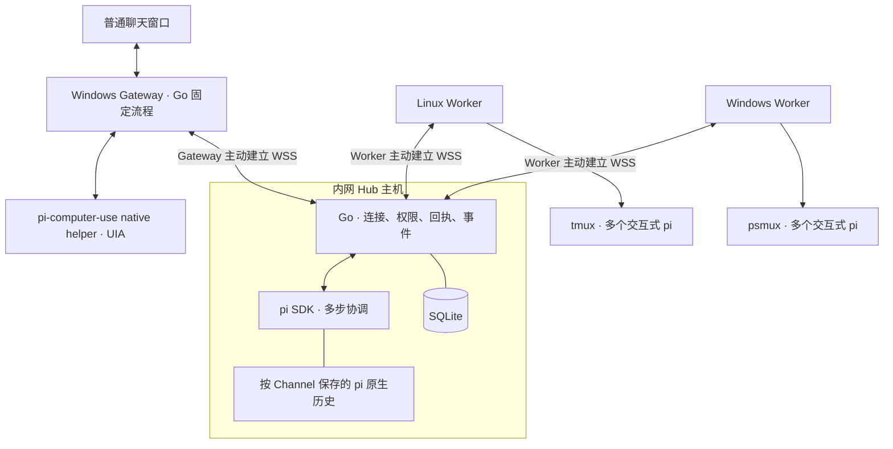

# RelayDock 架构设计

v0.7，2026-09-12。本文描述当前实现；部署步骤及目标 Windows 的验证边界见 [运行指南](getting-started.md)。

## 1. 目标与约束

用户在普通企微聊天中用自然语言指挥内网多台机器上的 Agent。Windows 无管理员操作权限；Worker 和 Gateway 以普通用户运行，主动建立到 Hub 的 WSS 连接。Hub 是唯一对内网监听的 RelayDock 进程。企业允许的出站地址、端口和目标 Windows 的本机运行能力需要实际核对。

同一主机可以运行多个 Session。用户随时 attach 到 tmux / psmux 中的 pi 查看或输入；本地消息仍同步到聊天，不设接管、交还、已读同步或终端在线占有状态。

普通企微收发已经由用户通过 pi + pi-computer-use 验证。新的固定收发实现复用其 native helper，仍需单独确认目标企微能提供足够的 UIA 结构与文本，不能从视觉 Agent 的成功推导出固定 UIA 脚本已可用。

## 2. 职责与运行位置

| 部分 | 做什么 | 不承担的职责 |
| --- | --- | --- |
| Channel / Gateway | 固定聊天来源、收发、轮询、检查点、发送核对 | 任务推理与执行 |
| Hub 的 pi SDK | 理解自然语言、组合工具、解释结果、安排明确后续 | 直接操作本地 shell 或绕过权限 |
| Hub 的 Go 核心 | 鉴权、资源归属、参数校验、调用回执、事件与持久队列 | 自建模型循环 |
| Worker | 本机远程工具、真实状态、调用去重和目录冲突检查 | 再运行一个任务协调模型 |
| 任务 pi | 在交互终端中执行用户工作，保留原生上下文 | 收发企微 |

这是两个核心角色加可替换的适配器。Gateway 独立部署是因为企微桌面位于受限 Windows；Hub 的 SDK 通过本地 stdin/stdout 接到 Go，不引入另一个网络服务。

## 3. Hub 使用成熟 agent loop

每条已接受的聊天输入先落 SQLite，处理器按序取出并标记已开始。一个协调回合启动 Node，加载已安装的 pi SDK，按认证 Channel 恢复专属 SessionManager 历史。pi 负责模型调用、连续工具调用和压缩；Go 负责实际派发。

SDK 只开放下列自定义工具，不加载全局 / 项目扩展、Skills、上下文文件或 shell / 文件内置工具：

| Hub 工具 | 用途 |
| --- | --- |
| `inventory` | 获准节点及能力、所属 Session、最新记录 |
| `session_create` | 创建空闲交互会话，不自动提交任务 |
| `session_inspect` / `session_result` | 查询真实运行状态 / 已保存结果 |
| `agent_submit` | 向空闲会话提交自然语言任务，返回 Run ID |
| `agent_interrupt` | 请求中断当前 Run |
| `terminal_capture` | 读取受管终端 |
| `session_close` | 显式关闭 Session |
| `session_watch` | 在指定 Run 结束后一次性唤醒 Hub，处理用户已要求的后续 |

工具名称和参数由模型选择，实际 Worker call ID、目标实例和原生会话引用由 Go 生成或查询。Go 检查 Channel → Node 授权、Session 归属以及 Worker 公布的 workspace / agent；工具结果不能扩大这些权限。

每回合最多派发 24 个工具调用，最多运行 3 分钟；共享处理器串行协调，但 Worker 中的任务并行执行。创建、提交等操作收到不确定回执后，该回合禁止继续执行有副作用的工具，仍可读状态。未开启模型自动重试，已派发任务不会因 SDK 子进程退出而重新提交。

`session_watch` 保存指定 Run 的一次性后续指令。完成事件和后续入队在同一事务中发生；即使注册时 Run 刚结束，也可入队。重复事件不会重复触发。关闭、中断删除后续安排，会话已经切换则跳过旧安排。异步后续不改变普通聊天当前关注的 Session，也不会每条日志都唤醒模型。

模型历史与业务事实分开保存：pi 原生历史帮助继续对话；SQLite 中的调用、Session、Run 和事件决定是否接受、执行或重复某次操作。`completed` 仅表示 pi 正常结束一轮响应，不能据此宣称代码或业务目标完成。

## 4. Gateway 是固定 computer-use 流程

固定流程调用 pi-computer-use Windows helper 的 JSON-lines protocol v3：`diagnostics`、`listRoots`、`look`、`uiaReadText`、`act`。helper 作为普通用户的本地子进程运行。RelayDock 不安装系统服务、不改变防火墙、不加载 Gateway pi 或模型。

首次成功观察建立历史基线；之后按配置周期执行：

1. 唯一定位应用窗口，核对当前聊天标题。
2. 找到消息列表和消息行，用 UIA 读取完整行文本，按配置正则提取 sender、text 及可选稳定 id。
3. 将连续的新入站消息保存为稳定本地 occurrence ID，再交给 Channel 的持久输入队列。仅接受配置的 peer，忽略自己的回显。
4. 获取最早待发送回复，先持久记录发送尝试。输入框有草稿时暂停；写入后重新观察、核对聊天及输入文本，再按发送控件。
5. 下一次观察必须找到唯一新增的 self 消息且文本完全一致，才标为已发送。无法确认时记录 unknown，不盲目再按发送。

控件选择器精确匹配原生 outline 的 role / identifier / title / description。操作引用只在所属 look 内有效，每次观察后重新定位。首版仅使用 UIA 语义动作 `ax_only`，不增加坐标点击或视觉模型回退。

有稳定消息 ID 时用其辅助锚定；没有时，以之前观察末尾最多三条连续消息定位唯一重叠。相同文字的不同 occurrence 可以上报，重复观察不会再次上报；重复锚点或连续性丢失时暂停输入。只靠可见历史无法保证无损读取：如果两次轮询之间整个窗口已换成外观完全相同的新消息，或离线期间历史已滚出可见范围，需要稳定身份或另一个可验证的读取方式。

输入检查点和发送状态持久化；未知发送阻塞后续发送以保序，仍继续尝试读取入站消息。helper 退出或超时会使本机调用失败，需要重启 Channel 后重新观察，不重放发送。`output_ack` 只代表 Gateway 接收并持久保存了输出；不代表已经发到企微，更不代表用户已读。

## 5. Worker 与任务会话

Worker 保留已有工具：`host.inspect`、`session.list`、`session.inspect`、`session.create`、`agent.submit`、`agent.interrupt`、`terminal.capture`、`session.close`。

一个 Session 对应一个受管 tmux / psmux 终端和交互式 pi；一个 Run 是其中一次响应。桥接扩展 `extensions/relaydock.ts` 通过本地文件交换输入、回执、心跳和追加事件。任务输入通过 pi API 投递，不把自然语言当 shell 命令，也不根据当前激活 pane 定位目标。

目录冲突、活跃 Session 数量、原生实例匹配和输入去重在 Worker 检查。Worker 可以重连到原 pi，无需替换进程。终端保留不等于 pi 健康；心跳、退出文件和 Agent 事件共同决定状态。具体边界见 [运行方案](runtime-tmux-pi.md)。

## 6. 故障恢复与拓展

SQLite 使用事务和单进程目录锁。聊天入站、调用回执、事件、发件箱分别持久化：Hub 重启后继续处理尚未开始的入站请求；已开始却未完成的请求只报告不确定，不重新推理派发。旧版未完成记录没有 started 字段时也保守处理。Worker 重连时通过 `call_status` 查询旧调用回执，查询不触发执行。

事件用每个实例序号及 Worker 日志位置去重、防倒退。本地交互也产生事件；用户看过消息不会取消同步。机器重启后的自动复活、任务自动重试、跨机器迁移不在当前实现中。

拓展只保留实际接口：`hub.Coordinator` 替换 agent loop，Channel 的 `ChatInput/ChatOutput` 替换聊天渠道，`wecom.Desktop` 替换桌面提取 / 操作实现，Worker 的 pi 与 mux 代码负责 Agent 适配。当前仍是一个 Go module、一个二进制和小型 pi 桥接扩展；出现第二个执行 Agent 后再提取共有协议，不预建插件框架。
