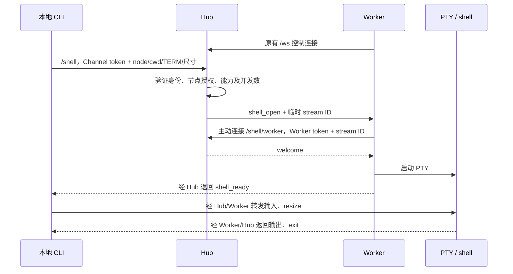

# 从本地终端连接远端 shell

2026-09-23。`relaydock shell` 提供 Windows / Linux / macOS 交互终端。Hub 转发终端字节，Worker 启动带 PTY / ConPTY 的 shell；这条链路不调用模型。Windows 需要提供 ConPTY API 的系统（Windows 10 1809 / Windows Server 2019 及以上）和支持 VT 的本地控制台。

## 使用

更新并启动 Hub 和目标 Worker，然后在本地真实终端运行：

```sh
go build -o build/relaydock ./cmd/relaydock
./build/relaydock shell --config .relaydock/channel.json \
  --node local --cwd project
```

`--node` 是目标 Worker ID，`--cwd` 必须是该 Worker 的 workspace 别名或存在的绝对目录。本地 stdin/stdout 都需要是终端，不支持管道模式。每次连接启动一个新 shell，其中 `cd`、环境变量和前台程序保持到本次连接结束。

客户端使用现有 **Channel** 配置与 token，Hub 检查其 `channels.<id>.nodes` 授权。终端连接不会替换同身份的聊天连接；客户端也不打开 `state_dir`，可以与正在运行的 Gateway 共用 Channel 凭据。也可以单独在 Hub 注册一个仅用于终端的 Channel ID/token，配置获准节点。

目标 Worker 需要启用 `shell`。Linux/macOS 默认 `/bin/sh -i`；需要熟悉的行编辑和 Tab 补全，可以配置 bash：

```json
{
  "shell": {
    "enabled": true,
    "kind": "sh",
    "executable": "/bin/bash",
    "max_running": 4
  }
}
```

修改后重启 Worker。也可使用 `/bin/zsh`；同一 `executable` 同时用于原有批量命令，需兼容 `-c` 和 `-i`。交互模式会加载对应 shell 的交互配置文件。默认 `/bin/sh` 的补全功能取决于本机实现。该功能本身不要求 pi、Node 或 tmux；只用终端时可用 `init --shell-only` 生成 Worker，Hub 无模型配置也能转发终端。

连接后：

- `Ctrl+C`、Tab、方向键等输入交给远端 PTY；窗口变化同步到远端。
- 输入 `exit` 退出 shell（Unix shell 也可在空行按 `Ctrl+D`）。Windows 客户端保留远端完整 32 位退出码；Unix 客户端只能返回低 8 位，若非零远端退出码截断为 0，则返回 1 并打印原始退出码。
- 行首输入 `~.` 主动断开；不确定是否在行首时先按 Enter。行首 `~~` 发送字面量 `~`，规则与 SSH 类似。
- 正常退出、连接丢失或收到 SIGTERM 后恢复本地终端模式。

## tmux 与消息同步

进入远端 shell 后直接操作 tmux：

```sh
tmux -L relaydock list-sessions
tmux -L relaydock attach-session -t <上一步列出的会话名>
```

使用 tmux 自己的 detach 快捷键回到外层 shell。RelayDock 不添加 attach 命令、接管状态或跨端已读状态。受管 pi 原有事件仍可同步聊天；在交互 shell 中执行的普通命令不会自动成为 Hub 的 shell job，也不会把终端输出发到企微。

是否形成终端嵌套，取决于运行 `relaydock shell` 客户端的终端位置：

- Worker 在 mux 会话 A 中，客户端在独立终端中，远端 shell 再 attach A：这是给 A 增加一个客户端。Worker 为远端 shell 创建独立 PTY / ConPTY，终端输出只通过网络回到客户端，不写回 Worker 所在的 pane。
- 客户端在 mux 会话 B 的 pane 中，再 attach A：A 的画面显示在 B 内，属于嵌套，类似在 tmux 中执行 SSH 后进入远端 tmux。两层会分别处理自己的快捷键。
- 客户端就在 A 内，再经 RelayDock attach 回 A，并显示运行该客户端的 pane：可能形成画面回流。应从 A 外的独立终端连接。

清理 Worker 继承的 mux 环境标记只解决新远端终端的误判，不检测客户端的显示链路，也不阻止上述自我回连。嵌套提示是否出现，不能单独用来判断是否存在嵌套或回流。

客户端断线、Hub/Worker 控制连接丢失时，关闭本次 PTY，并挂断外层 shell。Unix 清理只对外层 shell 补发 SIGHUP，必要时终止该 shell；不采用批量执行的进程树清理，因此独立 tmux server 保留。普通前台/后台程序能否继续由其终端挂断行为决定；需要持续运行的任务放进 tmux。

不自动重连、不重放键盘输入、不缓存供重连读取的输出。重新执行 `relaydock shell` 会打开一个新 shell，再自行 `tmux attach`。机器重启后的 tmux 恢复不在此功能范围内。

## 连接与限制



所有端点共用 Hub 的监听地址和端口。Worker 继续只主动出站连接，无需开放 Worker 入站端口。客户端根据配置中以 `/ws` 结尾的 Hub URL 推导 `/shell` 和 `/shell/worker`；若有反向代理前缀，需要把三条路径都代理到 Hub 并支持 WebSocket。

沿用 WSS、CA 校验和现有独立 Bearer Token；普通 WS 仅供 loopback。加入数据流时校验 Worker 身份、节点、原控制连接及 stream ID，禁止重复加入。输入与输出转发时重新检查 Channel→Node 授权。旧 Worker 不声明 `shell.interactive`，Hub 明确拒绝交互请求。

每个 Worker 的交互终端并发数使用 `shell.max_running`，默认 4、最大 64；它与非交互 job 使用**独立计数**，因此配置 4 最多允许 4 个终端加 4 个批量 job。交互终端不使用批量任务的超时和输出总量限制，也不占用 pi Session 的目录锁。

网络帧每块至多 16 KiB，字节按 base64 放入现有版本化 JSON envelope，保留 ANSI、中文和非 UTF-8 字节。连接内直接读写产生背压，单次网络写超时 10 秒；慢客户端会阻塞或断开自己的终端流，不增加无界内存队列。终端数据连接独立于 `/ws` 控制连接。启动等待至多约 15 秒；不持久化 stream、输入或输出，也不写入 Hub 的模型历史。

shell 继承 Worker 当前用户权限和环境，但新 PTY / ConPTY 不继承 Worker 所在终端的 `TMUX`、`TMUX_PANE`、`PSMUX_SESSION`、`PSMUX_ACTIVE` 及 psmux 会话路由标记，避免从 mux 内启动 Worker 后，新终端被误判为嵌套会话或命令被发往旧会话。此处理只作用于新 shell 的环境副本，不修改 Worker 或已存在的 mux 会话；用户的 mux 配置与显式嵌套策略保持不变。节点授权允许操作该节点上启用的 shell；workspace 别名是目录定位，不是访问沙箱。它和受管 pi 可以同时操作同一目录。

原有聊天工具 `remote_exec/status/cancel` 继续用于带持久日志、超时、取消和完成通知的非交互任务，详见 [批量 remote shell](remote-shell.md)。

## Windows 使用

在 PowerShell 或 Windows Terminal 中构建并运行：

```powershell
go build -o build/relaydock.exe ./cmd/relaydock
.\build\relaydock.exe shell --config .relaydock/channel.json --node local --cwd project
```

Windows Worker 的 `shell.kind` 使用 `powershell`，默认寻找 `pwsh`，不可用时回退到 `powershell.exe`；也可通过 `shell.executable` 指定包含空格的完整路径。启动交互式 PowerShell 时加载用户 profile，然后将控制台输入输出及 `$OutputEncoding` 设为 UTF-8，保证中文和 emoji 不受默认代码页影响。Tab 补全和编辑行为由该 shell 的配置决定。批量 job 的 `-NonInteractive` / `-File` 参数不用于交互终端，程序不会更改执行策略。

客户端关闭本地行缓冲、回显和 Ctrl+C 信号处理，通过 VT 输入把 Ctrl+C、方向键和 Tab 交给远端。Unicode 输入转为 UTF-8，输出启用 VT 并使用 UTF-8；窗口尺寸变化会同步。退出、取消和断线时解除阻塞的输入读取，恢复原控制台模式和代码页，并将远端启用的特殊键盘编码重置为普通输入，不关闭调用方 stdin/stdout。行首 `~.` / `~~` 同时适用于普通输入和 PowerShell 的 Win32 按键模式。

连接内可使用独立 psmux 会话：

```powershell
psmux -L relaydock list-sessions
psmux -L relaydock attach-session -t <会话名>
```

若旧版 `relaydock shell` 中出现 `sessions should be nested with care`，更新并重启目标 Worker 后重新连接；只更新本地 CLI 不会改变远端 shell 的环境。已经真正 attach 进入 psmux 的 pane 后，嵌套检查仍然有效，此时可用 `tmux switch-client -t <会话名>` 切换，或先 detach 再 attach。

ConPTY 清理会终止仍附着于该伪控制台的程序；RelayDock 不使用 Job Object 杀进程树。已脱离该终端的 psmux server 应在断线后保留，可重新连接并 attach。任意普通后台程序没有保活保证。

平台实现位于 `internal/terminal/backend_windows.go` 和 `client_windows.go` / `input_windows.go`。后端关闭可取消的管道来解除阻塞，再关闭 ConPTY；退出兜底仅终止外层 shell。Windows 返回完整 DWORD 状态码，需要 Hub 和 CLI 一起更新，旧版本只接受 0..255。

## 验证

```sh
go test -race ./...
go vet ./...
go test -race ./internal/hub -run 'Test(Windows|InteractiveTerminal|Terminal|ShellCLI)' -v -count=1
CGO_ENABLED=0 GOOS=linux GOARCH=amd64 go build -o build/relaydock-linux-amd64 ./cmd/relaydock
CGO_ENABLED=0 GOOS=windows GOARCH=amd64 go build -o build/relaydock-windows-amd64.exe ./cmd/relaydock
```

Windows 下先让 C 编译器位于 PATH，再启用竞态检查；例如使用 LLVM-MinGW 时：

```powershell
$env:CGO_ENABLED = '1'
$env:CC = 'clang'
go test -race ./...
go vet ./...
```

普通构建与 `go test ./...` 不需要 C 编译器。Windows 原生测试使用独立隐藏控制台和真实 ConPTY，不修改调用者的终端或发送真实聊天。覆盖 PowerShell 5.1 / pwsh、中文/emoji、ANSI、Ctrl+C、Tab/方向键、缩放、完整退出码、读写取消、认证、并发限制、断线清理和控制台恢复；psmux 用例需要安装 psmux，且只清理测试创建的独立命名空间。其中一项将真实 Worker 子进程放进目标 psmux 会话，再从独立客户端 attach 回该会话，检查输出有界、控制通道响应、detach 与断线后重连。Unix 原有测试继续覆盖 PTY、原始字节和 tmux 保活。

本次 Windows 验证环境为 Windows 11 企业版（build 26200）、psmux 3.3.3。Linux/macOS 的本次检查为交叉构建，原有 macOS 运行记录见前一提交。企微 UIA/Gateway 和受管 pi 的 Windows 现场验收仍是独立事项。
