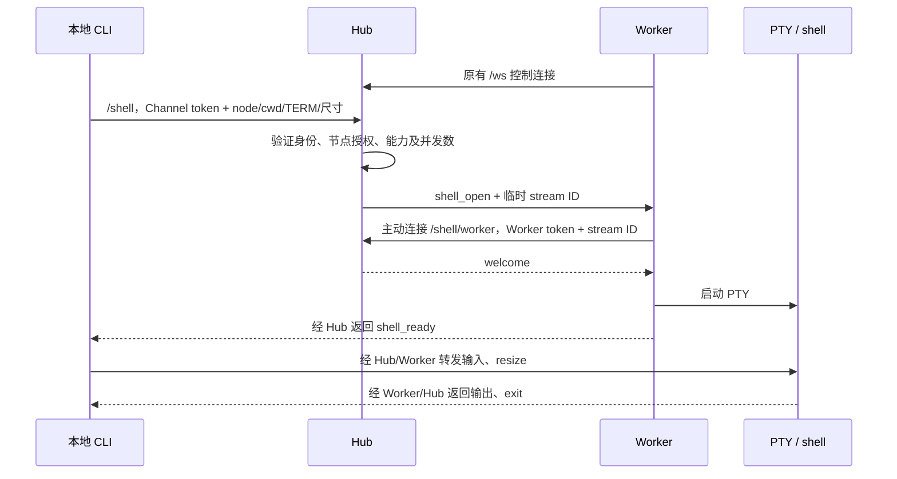

# 从本地终端连接远端 shell

2026-09-22。`relaydock shell` 提供 Linux/macOS 交互终端。Hub 转发终端字节，Worker 启动带 PTY 的 shell；这条链路不调用模型。Windows 的 ConPTY 后端和本地控制台适配留有接口，目前会明确返回不支持。

## 使用

更新并启动 Hub 和目标 Worker，然后在本地真实终端运行：

```sh
go build -o build/relaydock ./cmd/relaydock
./build/relaydock shell --config .relaydock/channel.json \
  --node local --cwd project
```

`--node` 是目标 Worker ID，`--cwd` 必须是该 Worker 的 workspace 别名或存在的绝对目录。本地 stdin/stdout 都需要是终端，不支持管道模式。每次连接启动一个新 shell，其中 `cd`、环境变量和前台程序保持到本次连接结束。

客户端使用现有 **Channel** 配置与 token，Hub 检查其 `channels.<id>.nodes` 授权。终端连接不会替换同身份的聊天连接；客户端也不打开 `state_dir`，可以与正在运行的 Gateway 共用 Channel 凭据。也可以单独在 Hub 注册一个仅用于终端的 Channel ID/token，配置获准节点。

目标 Worker 需要启用 `shell`。Linux/macOS 默认 `/bin/sh -i`；需要熟悉的行编辑和 Tab 补全，可以配置 bash：

```json
{
  "shell": {
    "enabled": true,
    "kind": "sh",
    "executable": "/bin/bash",
    "max_running": 4
  }
}
```

修改后重启 Worker。也可使用 `/bin/zsh`；同一 `executable` 同时用于原有批量命令，需兼容 `-c` 和 `-i`。交互模式会加载对应 shell 的交互配置文件。默认 `/bin/sh` 的补全功能取决于本机实现。该功能本身不要求 pi、Node 或 tmux；只用终端时可用 `init --shell-only` 生成 Worker，Hub 无模型配置也能转发终端。

连接后：

- `Ctrl+C`、Tab、方向键等输入交给远端 PTY；窗口变化同步到远端。
- 输入 `exit` 或在空行按 `Ctrl+D` 退出 shell，CLI 返回其退出码。
- 行首输入 `~.` 主动断开；不确定是否在行首时先按 Enter。行首 `~~` 发送字面量 `~`，规则与 SSH 类似。
- 正常退出、连接丢失或收到 SIGTERM 后恢复本地终端模式。

## tmux 与消息同步

进入远端 shell 后直接操作 tmux：

```sh
tmux -L relaydock list-sessions
tmux -L relaydock attach-session -t <上一步列出的会话名>
```

使用 tmux 自己的 detach 快捷键回到外层 shell。RelayDock 不添加 attach 命令、接管状态或跨端已读状态。受管 pi 原有事件仍可同步聊天；在交互 shell 中执行的普通命令不会自动成为 Hub 的 shell job，也不会把终端输出发到企微。

客户端断线、Hub/Worker 控制连接丢失时，关闭本次 PTY，并挂断外层 shell。Unix 清理只对外层 shell 补发 SIGHUP，必要时终止该 shell；不采用批量执行的进程树清理，因此独立 tmux server 保留。普通前台/后台程序能否继续由其终端挂断行为决定；需要持续运行的任务放进 tmux。

不自动重连、不重放键盘输入、不缓存供重连读取的输出。重新执行 `relaydock shell` 会打开一个新 shell，再自行 `tmux attach`。机器重启后的 tmux 恢复不在此功能范围内。

## 连接与限制



所有端点共用 Hub 的监听地址和端口。Worker 继续只主动出站连接，无需开放 Worker 入站端口。客户端根据配置中以 `/ws` 结尾的 Hub URL 推导 `/shell` 和 `/shell/worker`；若有反向代理前缀，需要把三条路径都代理到 Hub 并支持 WebSocket。

沿用 WSS、CA 校验和现有独立 Bearer Token；普通 WS 仅供 loopback。加入数据流时校验 Worker 身份、节点、原控制连接及 stream ID，禁止重复加入。输入与输出转发时重新检查 Channel→Node 授权。旧 Worker 不声明 `shell.interactive`，Hub 明确拒绝交互请求。

每个 Worker 的交互终端并发数使用 `shell.max_running`，默认 4、最大 64；它与非交互 job 使用**独立计数**，因此配置 4 最多允许 4 个终端加 4 个批量 job。交互终端不使用批量任务的超时和输出总量限制，也不占用 pi Session 的目录锁。

网络帧每块至多 16 KiB，字节按 base64 放入现有版本化 JSON envelope，保留 ANSI、中文和非 UTF-8 字节。连接内直接读写产生背压，单次网络写超时 10 秒；慢客户端会阻塞或断开自己的终端流，不增加无界内存队列。终端数据连接独立于 `/ws` 控制连接。启动等待至多约 15 秒；不持久化 stream、输入或输出，也不写入 Hub 的模型历史。

shell 继承 Worker 当前用户权限和环境。节点授权允许操作该节点上启用的 shell；workspace 别名是目录定位，不是访问沙箱。它和受管 pi 可以同时操作同一目录。

原有聊天工具 `remote_exec/status/cancel` 继续用于带持久日志、超时、取消和完成通知的非交互任务，详见 [批量 remote shell](remote-shell.md)。

## Windows 实现交接

公共转发、认证、限流和协议已可复用。平台适配位于 `internal/terminal`：

| 文件 / 接口 | 待实现内容 |
| --- | --- |
| `backend.go` 的 `Process` | `Read`、`Write`、`Resize`、`Hangup`、`Kill`、`Wait` |
| `backend_windows.go` | 创建 ConPTY、关联 shell 进程、字节流和尺寸更新；成功实现后启用 `Supported` 和按 kind 判断的 `SupportsShell` |
| `client_windows.go` | `prepareConsole`：原始输入、VT 输出、窗口事件、关闭时唤醒阻塞输入，以及恢复原控制台状态 |

`Start` 接收配置归一化后的 shell 可执行文件、cwd、TERM 和尺寸；启动参数由平台实现决定。不要把 Unix 的 `-i` 原样用于 PowerShell。当前 Windows 默认 shell kind 是 `powershell`。

`Wait` 只调用一次并返回退出码；`Hangup` 必须可重复调用，并解除阻塞的 Read/Write；`Kill` 只用于外层 shell 的退出兜底。不要复用 `internal/remote` 的 `KILL_ON_JOB_CLOSE` 进程树策略，否则会杀掉希望保留的 psmux server。本地 `console.input.Close` 同样必须唤醒阻塞读，避免退出时卡住恢复流程。

Windows 现场重点验证：PowerShell 参数引用、中文和 ANSI、Ctrl+C、Tab、窗口缩放、网络中断、正常/信号退出后的控制台恢复，以及连接内启动/attach 的 psmux 在断线后继续存活。当前没有 Windows 运行验收。

## 验证

```sh
go test -race ./...
go vet ./...
go test -race ./internal/hub -run 'Test(InteractiveTerminal|Terminal|ShellCLI)' -v -count=1
CGO_ENABLED=0 GOOS=linux GOARCH=amd64 go build -o build/relaydock-linux-amd64 ./cmd/relaydock
CGO_ENABLED=0 GOOS=windows GOARCH=amd64 go build -o build/relaydock-windows-amd64.exe ./cmd/relaydock
```

集成测试使用真实 Hub、Worker、PTY 和本地 CLI，覆盖输入输出、退出码、Ctrl+C、Tab、中文/原始字节、resize、多终端隔离、并发上限、慢输出不阻塞控制链路、认证拒绝、迟到加入、tmux 存活和本地控制台恢复。测试不调用模型或发送真实聊天。tmux 存活用例需要本机安装 tmux。本次运行验证环境为 macOS；Linux 和 Windows 构建成功仍需各自在目标机器验收。
