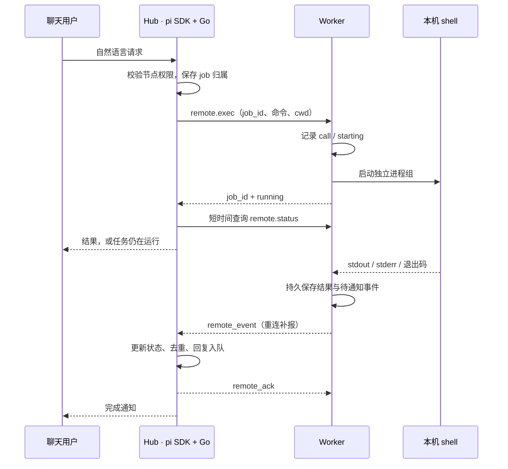

# Remote shell：实现与使用

v0.8，2026-09-12。为 Hub 的 pi SDK 增加 `remote_exec`、`remote_status`、`remote_cancel` 三个自定义工具；Worker 使用现有 WSS 连接执行本机命令。聊天用户继续输入自然语言，例如“看看 Linux 构建机的磁盘空间”“在 project 目录跑测试，结束后告诉我”“停止刚才的测试”。

## 范围与模块



执行层位于 `internal/remote`；协议位于 `internal/protocol/remote.go`；Worker 和 Hub 各有一个 `remote.go` 适配文件。shell 生命周期不依赖 WSS 请求上下文。Worker 只短暂处理启动请求，命令在独立 goroutine 中等待退出，不长期占用调用分派锁。

保留现有 pi 会话工具。shell 适合检查环境、执行脚本、构建测试、文件操作；需要交互终端和持续 Agent 上下文时仍用 tmux / psmux 中的 pi。首版没有 PTY、远程 stdin、文件传输协议、任意 per-call shell 可执行文件选择或动态插件注册。替换协调模型、聊天入口或 Agent 不要求改写这一层，也不引入 SSH 服务或新的监听端口。

## 启用

新生成的 Worker 配置默认包含 `"shell": {"enabled": true}`。旧配置不会自动开启，按机器补充此片段并重启 Worker：

```json
{
  "shell": {
    "enabled": true,
    "max_running": 4,
    "max_timeout_ms": 3600000,
    "max_output_bytes": 1048576
  }
}
```

只需要远程 shell 的机器可以省去 pi、Node、tmux / psmux 和桥接扩展：

```sh
./build/relaydock init --dir .relaydock-shell --shell-only \
  --workspace /path/to/project \
  --model-url http://model-host:8000/v1 --model your-model
./build/relaydock worker --config .relaydock-shell/worker.json
```

以上 `init` 同时生成 Hub / Channel 配置；运行在其他主机的 Hub 仍需要 Node 和 pi SDK，并需分别启动 Hub、聊天入口。接入已有 Hub 时配置这个 Worker 的 ID、独立 token、WSS 地址和 CA；[shell-only 模板](../examples/shell-worker.json) 可供修改。

Unix 默认使用 `/bin/sh -c`。Windows 默认寻找 `pwsh`，不可用时使用 `powershell.exe`。需要固定版本可配置：

```json
{
  "shell": {
    "enabled": true,
    "kind": "powershell",
    "executable": "C:/Program Files/PowerShell/7/pwsh.exe"
  }
}
```

`kind` 仅支持 `sh` 和 `powershell`。包含目录分隔符的相对 executable 路径按配置目录解析，单个程序名按 PATH 查找。Worker 将实际 shell、平台和限制公布给 Hub，模型据此选择语法。

每次调用是一个新的非交互 shell，stdin 为 EOF。`cwd` 必须是已配置 workspace 别名或本机存在的绝对目录；`cd`、变量和环境变更不会延续到下一次调用，连续步骤应放在同一个脚本中。进程继承 Worker 的环境和当前用户权限；workspace 别名只是目录定位，**不是文件系统沙箱**。shell 调用不使用 pi Session 的目录排他检查，需要避免同时修改同一项目。Hub 指令要求受管 pi 会话继续走结构化工具；工具本身并不把任意 shell 限制为只读。

PowerShell 脚本以 UTF-8 BOM 写入 `.ps1`，以 `-NoLogo -NoProfile -NonInteractive -File` 执行，设置 UTF-8 输出和 `$ErrorActionPreference = 'Stop'`。显式 `exit N` 以及最后执行失败的本机程序返回非零退出码；PowerShell 终止错误返回 1。不会设置 `ExecutionPolicy Bypass`。实际企业策略禁止脚本时，命令失败并返回错误。旧程序自行输出 GBK / OEM / UTF-16 时不能保证 UTF-8 文本正确，需要在命令中显式转码；这不是二进制传输接口。

## 工具契约

| Hub 工具 | 参数与结果 |
| --- | --- |
| `remote_exec` | 必填 `node`、`command`、`cwd`；可选 `timeout_ms`、`wait_ms`。返回 job 元信息、输出第一页、cursor 和是否仍有输出 |
| `remote_status` | 必填 `job_id`；可选 `cursor`、`limit`，读取增量 stdout / stderr，不执行命令 |
| `remote_cancel` | 必填 `job_id`；只取消当前 Worker 保有进程句柄的任务。返回取消请求状态，最终结果随后通知 |

`job_id` 由 Hub 生成，归属认证 Channel。查询和取消检查归属与节点授权；不接受模型提供的身份或 token。Worker wire 工具分别为 `remote.exec/status/cancel`。

`remote_exec` 默认在 Hub 等待最多约 1 秒，可选 0–2 秒；这是收到启动回执后的查询预算，网络故障仍受已有调用回执超时限制。超出后返回仍在运行的 job，不要求模型循环轮询。默认命令超时为 `min(60 秒, shell.max_timeout_ms)`，需要更久时显式传入 `timeout_ms`。长命令完成后自动发一次通知；首版 shell job 不注册动态的 Hub 后续回合，`session_watch` 仍只适用于 pi Run。

输出字段包括 `stdout`、`stderr`、`cursor`、`next_cursor`、`has_more`。将 `next_cursor` 原样传给下一次查询，不自行计算；省略 cursor 从头读取。默认每条流读取 16 KiB，`limit` 可选 4–32768 字节。边界尽量不切开 UTF-8 字符；无效字节替换为 `�`，游标仍按原始字节计数。

每条流默认最多保存 1 MiB，超出后继续排空管道并丢弃内容，防止进程因输出上限阻塞。`stdout_bytes/stderr_bytes` 记录排空的总字节数；`truncated` 明确表示存在无法再查询的内容。允许配置每流 64 字节–16 MiB，最大并发 1–64、最长超时 1 毫秒–24 小时。完成通知只带短摘要；需要完整的已保存输出时继续分页查询。

Hub 离线查询只返回标注 `stale/offline` 的缓存第一页，不应用 cursor / limit；Worker 重新上线才能查询完整日志。Hub 中的 recent inventory 限制为最近 50 个 job，已知旧 job ID 仍可查询。聊天当前关注的 shell job 单独记录，完成通知不修改关注对象，也不检查用户是否已在本地读过输出。

## 退出与恢复

| 情况 | 行为 |
| --- | --- |
| shell 正常退出 | 退出码 0 为 `succeeded`，非零为 `failed`；不据此自动宣称业务目标成功 |
| 超时 / 用户取消 | 终止本次进程组，记录 `timed_out` / `cancelled` 与输出 |
| WSS 断线 / Hub 重启 | Worker 内的进程继续；结果持久化后重连补报 |
| Worker 正常退出 | Ctrl+C / Unix SIGTERM 触发清理，取消活跃 shell 进程组；已有 pi Session 保持原行为 |
| Worker 崩溃 / 强制结束 / 主机重启 | 不保证 shell 继续或结束；未落盘最终结果的 job 在下次启动时标记 `unknown`，保留已有日志，绝不重跑 |
| 启动回执丢失 | 通过旧 call ID 查询回执 / 现有 job；不重新启动命令 |
| 用户重复询问结果 | 可再次发送已经看过的结果；同一完成事件只生成一次自动通知 |

Unix 使用进程组，Windows 在进程恢复执行前将其加入带 `KILL_ON_JOB_CLOSE` 的 Job Object。正常命令退出后也清理剩余普通子进程，因此不要用此工具启动需要独立存活的后台服务。Unix 主动 `setsid` / daemon 化的子进程可能脱离组；不保证取消这样的进程。Windows 强制结束 Worker 通常会随 Job Object 关闭终止子进程，结果仍可能未知。恢复代码不会依据旧 PID 杀进程，避免 PID 复用造成误杀。

Worker SQLite 的 `remote_jobs` 保存任务，`remote_outbox` 保存待确认完成事件；完整已捕获输出位于 `state_dir/shell-jobs/<job_id>/stdout` 和 `stderr`，PowerShell 另有 `command.ps1`。Hub 在同一事务中完成事件去重、状态合并和回复入队，晚到的 running 回执不会覆盖终态。当前没有日志自动清理；单 job 的输出有上限，总磁盘占用仍随 job 数增长。

## 验证

```sh
go test -race ./...
go vet ./...
RELAYDOCK_TEST_PI=1 go test -race ./internal/hub -run 'TestRealPi(RemoteRuntime|Runtime)$' -v -count=1
```

测试覆盖本机真实 shell、并发 / 超时 / 子进程取消、中文游标与输出上限、shell-only Worker、重复调用去重、恢复 unknown、真实 WSS 断线完成补报、跨 Channel 权限、通知与回执竞态，以及 pi SDK 的三种 remote 工具调用。模型是本地测试服务，不发送真实企微消息。

Windows / Linux 交叉编译不等同于运行验收。在目标 Windows 上需验证 PowerShell 策略、中文和本机程序退出码、Job Object 创建/取消子进程、普通用户退出清理与 WSS 重连；已有 Gateway / psmux 的现场验收边界保持见运行指南。
