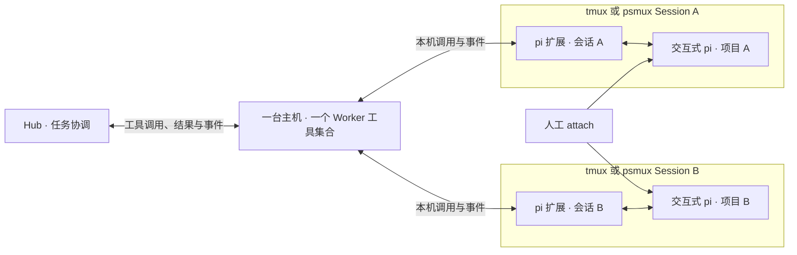

# 首版运行方案：tmux / psmux + pi

状态：建议采用，2026-09-10。依据是用户提出的部署方案，以及本次对 psmux、pi 上游文档的审阅。本文没有将上游说明当作目标 Windows 上的运行验证；用户已验证的 pi + pi-computer-use 企微收发能力继续作为既有基础。

职责按架构 v0.6 划分：Hub 决定任务安排和工具调用，Worker 暴露并执行本机终端与 Agent 工具。用户直接在终端或企微参与同一个 Session，自行衔接两端信息；系统持续同步消息，不要求接管或交还，也不维护跨端已读状态。

## 1. 判断

这套组合适合 RelayDock 首版：同一主机可以承载多个独立 Agent，用户随时 attach 到原终端查看和操作，Worker 退出后可以重新连接原 pi。它利用现成终端复用器，避免自己实现交互终端和完整进程托管。

可靠性收益主要来自终端客户端与承载进程分离。关闭客户端或 detach 不应连带结束 pi；tmux/psmux 不会降低 pi 内部崩溃的概率，也不能让进程跨越机器重启继续存活。保留 pi 会话引用、运行记录和重新发现能力即可，首版不建设自动拉起与自动重试系统。

## 2. 一个 Session 对应一个常驻 pi

建议默认一 pi 一终端 Session，每个 Session 一个工作 pane，便于独立命名、定位和 attach。业务任务可以跨多个 Run 持续使用同一个 pi。

Worker 保存以下定位信息作为 RelayDock Session 的字段，不另建一套实例平台：

- 本机终端后端 `tmux / psmux`、专用命名空间、Session 名称与 pane 标识。
- pi 原生会话引用和本次 pi 启动实例标识，防止进程重启后把旧消息交给新实例。
- 工作目录、当前 Run 关联及本机事件读取位置；读取位置表示系统已处理的事件，不表示用户已读。

所有操作显式指向目标，不能依赖当前激活 pane、“最近使用的 Session”或 pid 单独判断身份。终端的稳定 ID 也有生存周期；Worker 重启后同时核对 pi 扩展报告的实例和原生会话。

## 3. 终端承载与任务协议分开

tmux/psmux 负责创建、发现、attach 和保留终端。Worker 内的 `session.list/create/inspect/close` 和 `terminal.capture` 等工具调用一个小型后端接口，分别适配命令差异；Hub 组合调用这些工具。无需额外启动服务，也不要求实现全部 tmux control mode。

任务输入、状态和结果推荐走一个 **pi 扩展**。首版可用本机文件请求队列与追加事件文件连接 Worker 和扩展：每个会话一个目录，完整请求先写临时文件再原子提交，事件由扩展单方追加并带序号，Worker 只消费完整记录并保存确认位置。文件与事件均有容量上限，关键写入失败时不能接受新任务。它复用既有本机持久化，不增加 Windows 对外端口。

这只是小型本机通道，不扩展为通用消息队列。具体文件布局在实现时确定；在 pi 里监听和写事件的代码随项目提供，由现有 pi 运行时加载，不要求把 pi 重写成 Go。

本次审阅的 pi 上游扩展文档提供：

- `pi.sendUserMessage()`：从扩展向当前 pi 提交消息，同时保留交互式界面。
- `input`：可区分交互输入、RPC 和扩展输入；但部分扩展命令先执行并绕过该事件，因此不能仅靠它识别所有人工操作。
- 运行和消息事件：用于上报开始、进展、结果及会话变化。
- `agent_settled`：当前文档中表示没有自动重试、压缩重试或后续排队消息会继续执行；`agent_end` 只表示一次底层运行结束。安装版是否具备这些事件须核对，不能硬编码假定。
- `ui_prompt_start/end`：可用于报告正在等待用户，属于通知事件，不保证能程序化回答所有自定义 UI。

扩展按工具的 `call_id` 去重，并在投递前检查目标 pi 实例、原生会话和实际运行状态。`agent.submit` 返回输入已接受后，pi 独立执行，Worker 转发事件；工具调用成功不等于用户任务完成。首版不在忙碌的 pi 内偷偷积攒远程 follow-up，运行中输入只开放已实现的能力。用户 attach 或本地阅读不影响工具可用性，输入按 pi 实际接受的顺序执行。Hub 结合适配器报告的真实结果、错误和空闲事件维护 Run，不能把空闲直接等同于任务成功。

`send-keys` 与 `capture-pane` 可以用于原型诊断或人工工具，但不作为权威业务协议：终端会重绘，提示符会变化，pi 退出后同一 pane 可能已经回到 shell。向错误状态的 pane 注入自然语言尤其容易变成错误的终端操作。psmux 还有 ConPTY 的屏幕缓冲差异，见第 6 节。

## 4. 用户直接参与，消息继续同步

用户直接 attach 到 pi 查看和输入；企微仍然是同一个 Session 的消息入口和输出渠道。系统不设控制权切换，不申请接管或交还，不根据终端连接数判断“人工在线”。用户已经在本地看过的消息，照常按同步规则发送到企微。

保留的规则只围绕消息和实际执行：

1. 扩展记录本地输入、Hub 输入和 Agent 输出；来源是关联信息，不代表控制权。新本地轮次用稳定标识交给 Hub 映射为 Run，运行中的补充消息关联到实际轮次。
2. 输入按 pi 实际接受的顺序处理；运行中是否能提交新消息遵循目标 pi 的已实现能力。attach、detach 和本地阅读不会暂停远程输入，也不触发通知过滤。
3. pi 会话切换、新建或分支后更新原生会话定位，过期的实例或交互引用需重新核对；这不要求用户执行交还动作。
4. 本地开始或继续任务产生的结果同样同步到绑定企微会话。为让消息可理解，可保留必要的本地输入上下文及机器、任务名称。
5. 工具调用和事件仍按 ID 去重，防止一次请求被网络重放后执行两遍；同一内容在两个入口展示是正常行为。用户两次独立输入即使文字相同，也不能仅按文本合并。

不增加跨端已读标记或消息消重确认流程。事件游标表示系统处理进度，和用户读到哪里没有关联。用户在两个入口交替参与时，由用户自行理解已做过的操作。

用于企微收发的 pi 保持独立会话；多个终端不会隔离同一个 Windows 桌面，因此 pi-computer-use 的桌面读写仍按 Gateway 原有串行约定执行。

## 5. 并发与恢复的最小规则

每台主机一个 Worker，Hub 根据工具查询返回的容量与占用情况，安排多个 Session 并行；每个 Session 同时最多一个 Run。Worker 执行时再次检查容量和互斥条件，忙碌则返回错误，由 Hub 决定后续处理。使用不同项目目录的会话可以独立执行；并行修改同一仓库时先准备不同 worktree，首版不自动创建和回收 worktree。

Hub 根据已知目录安排任务，Worker 的最终冲突检查以本机实际目录和运行活动为依据，而不是仅比较别名。本地输入实际启动了运行时同步更新占用事实，仅 attach 或阅读不占用额外资源，也不锁定会话。tmux/psmux 不提供文件隔离，用户在外部直接修改文件仍由用户协调。

Worker 重启时先查已有终端与 pi 扩展，将事实和调用记录返回 Hub，由 Hub 核对任务：

- 原实例仍在，事件和当前状态吻合：重新连接并补报，不创建第二个 pi。
- pane 存在但 pi 不在：不能因 shell 还活着就显示 Agent 在线；保留原生会话引用供明确恢复操作使用。
- pi 存活但扩展失联：标明状态暂不可确认，不向终端盲发任务。
- pi 或复用器后台进程退出：Worker 报告实例退出及已有结果，由 Hub 将受影响 Run 核对为失败或未知；Worker 不自动重新执行请求。

Hub 暂停派发只作用于受影响 Session 及冲突工作目录；Worker 同时拒绝目标不明确的调用，不因为一项未知任务把所有无关 Agent 都停住。

## 6. psmux 的具体适配边界

本次查阅的是上游当前文档，尚未运行用户目标 Windows 上的 psmux。值得纳入实现的事实是：

- 它是基于 ConPTY 的原生 Windows 终端复用器，不要求 WSL；后台进程按当前用户运行，不是 Windows 系统服务。
- 它用 `127.0.0.1` TCP 与用户目录中的会话信息完成本机连接。RelayDock 无需向内网开放 Windows 端口，但应验证企业策略允许这段本机通信。
- 它提供 `new-session`、`attach`、命名空间 `-L`、稳定 pane ID、`send-keys`、`capture-pane`、`pipe-pane` 和 control mode。只适配首版实际需要的子集。
- **psmux 每个 Session 一个后台进程**，不同于 tmux 一个服务器持有多个 Session。不要把 tmux 的进程数量和全局订阅方式原样套到 Windows。
- **不带命名空间的 `psmux kill-server` 会结束所有命名空间的会话。** Worker 使用专用命名空间和显式目标；日常停止 Run 不关闭复用器服务器，删除会话也只针对目标。
- 上游列出 ConPTY 的屏幕缓冲、输出规范化和 Ctrl+C 传播差异。不要以 `capture-pane` 内容或一次 Ctrl+C 注入认定 pi 已完成或工具进程已停止。

首版以目标安装版为准固定调用方式。已有 CLI 兼容能力足够开始适配，不把“兼容 tmux”理解成所有命令、格式字段和退出语义完全一致。

## 7. 第一轮应验证的完整流程

1. 在同一主机创建两个独立 Session，各启动一个带扩展的 pi，确认输入和输出不会串到另一会话。
2. 在两个不同工作目录并行执行，完成后复用原 pi 继续任务。
3. 用户直接 attach 到一个 Session 查看结果并发起下一轮；新消息仍发送到企微，再从企微继续同一个 Session，全程没有接管或交还操作。另一 Session 继续独立运行。
4. detach/关闭终端客户端、重启 Worker，再连接到原 pi，确认没有重复启动或重复任务。
5. 让一个 pi 明确退出，区分“pane/shell 存活”和“pi 可用”，避免将后续请求注入 shell。
6. 在 Windows psmux 中检查中文、多行、引号、交互界面、后台运行、取消及局部清理的实际行为。

这轮验证集中于复用器、pi 扩展和 Worker 的组合行为；企微基础收发沿用用户已有验证。

## 8. 上游依据

- [psmux 架构与进程模型](https://github.com/psmux/psmux/blob/master/docs/architecture.md)
- [psmux 脚本与格式字段](https://github.com/psmux/psmux/blob/master/docs/scripting.md)
- [psmux 与 tmux 的行为差异](https://github.com/psmux/psmux/blob/master/docs/compatibility.md)
- [psmux control mode 与 ConPTY 限制](https://github.com/psmux/psmux/blob/master/docs/control-mode.md)
- [pi 扩展：消息注入、输入来源与生命周期事件](https://github.com/earendil-works/pi/blob/main/packages/coding-agent/docs/extensions.md)
